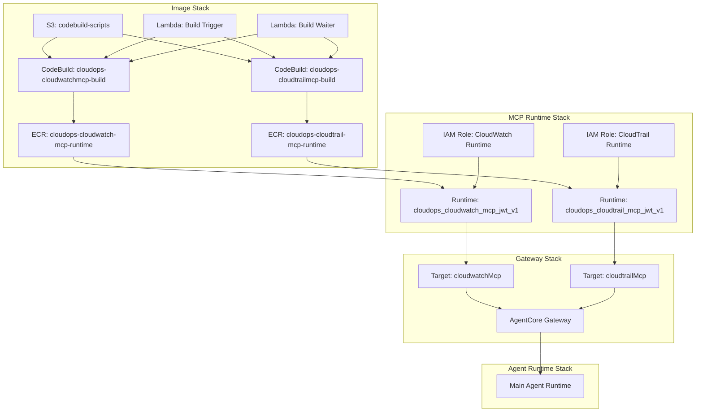

# Design Document: CloudWatch & CloudTrail MCP Servers

## Overview

This design extends the CloudOps Agent platform with two new MCP servers — CloudWatch and CloudTrail — following the established patterns for the billing and pricing MCP servers. The implementation adds:

1. **ECR Repositories** for storing container images (Image Stack)
2. **Transform Scripts** that patch upstream AWS Labs MCP servers for streamable-http transport
3. **Buildspec Files** that orchestrate CodeBuild pipelines
4. **CodeBuild Projects** triggered during deployment via Custom Resources
5. **AgentCore Runtimes** with JWT authorization (MCP Runtime Stack)
6. **Gateway Targets** registered in the AgentCore Gateway (Gateway Stack)
7. **System Prompt Updates** so the agent knows how to route CloudWatch/CloudTrail queries

The design reuses the existing stdio-to-HTTP transformation pattern, the same Lambda-based build trigger/waiter mechanism, and the same CDK stack layering (Image → Auth → MCP Runtime → Gateway → Agent Runtime).

## Architecture



### Deployment Sequence

The stack dependency chain remains:

```
ImageStack → AuthStack → MCPRuntimeStack → GatewayStack → AgentRuntimeStack
```

Within ImageStack, the new CodeBuild projects follow the same pattern as billing/pricing:

1. S3 deployment uploads `codebuild-scripts/` (including new buildspec + transform files)
2. Build Trigger Lambda starts CodeBuild
3. Build Waiter Lambda polls until completion
4. ECR repository contains the final image

## Components and Interfaces

### 1. Transform Scripts

Two new shell scripts following the established pattern in `codebuild-scripts/`:

**`transform-cloudwatch.sh`**

- Clones `https://github.com/awslabs/mcp.git` (shallow, depth 1)
- Navigates to `src/cloudwatch-logs-mcp-server`
- Patches `server.py`: replaces `mcp.run()` call with `mcp.run(transport='streamable-http', host='0.0.0.0', port=8000, stateless_http=True)`
- Adds `fastmcp>=2.0.0,<3.0.0` dependency to `pyproject.toml`
- Regenerates `uv.lock` using `uv lock`
- Patches Dockerfile: removes `UV_FROZEN`/`--frozen`, adds `EXPOSE 8000`, updates entrypoint
- Replaces `docker-healthcheck.sh` with `curl -sf http://localhost:8000/mcp`
- Validates all transformations with grep assertions

**`transform-cloudtrail.sh`**

- Same pattern as above but targets `src/cloudtrail-mcp-server`
- Patches the CloudTrail server module entrypoint
- Same dependency, Dockerfile, and healthcheck transformations

Both scripts exit non-zero on validation failure, which propagates through CodeBuild to fail the CloudFormation deployment.

### 2. Buildspec Files

**`buildspec-cloudwatch.yml`** and **`buildspec-cloudtrail.yml`**

Format: buildspec version 0.2 with three phases:

- `pre_build`: Make transform script executable, run it, authenticate to ECR
- `build`: `cd` into transformed source, `docker build` with build number tag, tag as `latest`
- `post_build`: Push both tags to ECR

### 3. Image Stack Changes (`cdk/lib/image-stack.ts`)

New resources added:

- `cloudwatchMcpRepository: ecr.Repository` — named `cloudops-cloudwatch-mcp-runtime`
- `cloudtrailMcpRepository: ecr.Repository` — named `cloudops-cloudtrail-mcp-runtime`
- CodeBuild project `cloudops-cloudwatchmcp-build` using `buildspec-cloudwatch.yml`
- CodeBuild project `cloudops-cloudtrailmcp-build` using `buildspec-cloudtrail.yml`
- Custom Resources for build trigger + waiter (reusing existing Lambda functions)

New public properties exposed:

- `cloudwatchMcpRepository: ecr.Repository`
- `cloudtrailMcpRepository: ecr.Repository`

New outputs:

- `CloudWatchMcpRepositoryUri`
- `CloudTrailMcpRepositoryUri`

### 4. MCP Runtime Stack Changes (`cdk/lib/mcp-runtime-stack.ts`)

**Interface additions to `MCPRuntimeStackProps`:**

```typescript
cloudwatchMcpRepository: ecr.IRepository;
cloudtrailMcpRepository: ecr.IRepository;
```

**New resources:**

- `CloudWatchMcpRuntimeRole` — IAM role with:
  - Common runtime permissions (ECR auth, CloudWatch Logs, Gateway invocation)
  - `cloudwatch:*` and `logs:*` on all resources
  - ECR pull on CloudWatch repository
- `CloudTrailMcpRuntimeRole` — IAM role with:
  - Common runtime permissions
  - `cloudtrail:LookupEvents`, `cloudtrail:GetTrailStatus`, `cloudtrail:DescribeTrails`, `cloudtrail:GetEventSelectors`, `cloudtrail:ListTrails`
  - ECR pull on CloudTrail repository
- `CloudWatchMcpRuntime` — `AWS::BedrockAgentCore::Runtime` named `cloudops_cloudwatch_mcp_jwt_v1`
- `CloudTrailMcpRuntime` — `AWS::BedrockAgentCore::Runtime` named `cloudops_cloudtrail_mcp_jwt_v1`

Both runtimes use:

- CustomJWTAuthorizer with Cognito OIDC discovery URL
- PUBLIC network mode
- MCP protocol configuration
- Environment variables: `AWS_REGION`, `DEPLOYMENT_TIMESTAMP`

**New public properties:**

```typescript
public readonly cloudwatchMcpRuntimeArn: string;
public readonly cloudtrailMcpRuntimeArn: string;
public readonly cloudwatchMcpRuntimeEndpoint: string;
public readonly cloudtrailMcpRuntimeEndpoint: string;
```

Endpoint URL format (same as billing/pricing):

```
https://bedrock-agentcore.{region}.amazonaws.com/runtimes/{URL-encoded-ARN}/invocations?qualifier=DEFAULT
```

### 5. Gateway Stack Changes (`cdk/lib/gateway-stack.ts`)

**Interface additions to `AgentCoreGatewayStackProps`:**

```typescript
cloudwatchMcpRuntimeArn: string;
cloudwatchMcpRuntimeEndpoint: string;
cloudtrailMcpRuntimeArn: string;
cloudtrailMcpRuntimeEndpoint: string;
```

**New resources:**

- `CloudWatchMcpTarget` — `AWS::BedrockAgentCore::GatewayTarget` named `cloudwatchMcp`
- `CloudTrailMcpTarget` — `AWS::BedrockAgentCore::GatewayTarget` named `cloudtrailMcp`

Both targets use:

- OAUTH credential provider referencing the existing OAuth provider ARN
- Scope: `mcp-runtime-server/invoke`
- Dependency on the Gateway resource

### 6. CDK App Entry Point Changes (`cdk/bin/app.ts`)

Pass new repositories from ImageStack to MCPRuntimeStack:

```typescript
cloudwatchMcpRepository: imageStack.cloudwatchMcpRepository,
cloudtrailMcpRepository: imageStack.cloudtrailMcpRepository,
```

Pass new runtime ARNs/endpoints from MCPRuntimeStack to GatewayStack:

```typescript
cloudwatchMcpRuntimeArn: mcpRuntimeStack.cloudwatchMcpRuntimeArn,
cloudwatchMcpRuntimeEndpoint: mcpRuntimeStack.cloudwatchMcpRuntimeEndpoint,
cloudtrailMcpRuntimeArn: mcpRuntimeStack.cloudtrailMcpRuntimeArn,
cloudtrailMcpRuntimeEndpoint: mcpRuntimeStack.cloudtrailMcpRuntimeEndpoint,
```

### 7. Agent System Prompt Update (`agentcore/agent_runtime.py`)

Add to the system prompt's tool category list:

```
- CloudWatch Monitoring: Query metrics, check alarm status, list log groups, run CloudWatch Logs Insights queries
- CloudTrail Auditing: Look up API event history, check trail status, investigate resource changes and account activity
```

Add routing guidance:

```
When using CloudWatch tools:
- Use `cloudwatchMcp__`-prefixed tools for metrics, alarms, and log analysis
- Use these when the user asks about operational health, monitoring, or log investigation

When using CloudTrail tools:
- Use `cloudtrailMcp__`-prefixed tools for API activity and event history
- Use these when the user asks about who did what, resource changes, or account auditing
```

## Data Models

### Stack Props Interfaces

```typescript
// Image Stack — no new input props (self-contained)
// Exposes:
export class ImageStack {
  public readonly cloudwatchMcpRepository: ecr.Repository;
  public readonly cloudtrailMcpRepository: ecr.Repository;
  // ... existing properties
}

// MCP Runtime Stack — new input props
export interface MCPRuntimeStackProps extends cdk.StackProps {
  // ... existing
  cloudwatchMcpRepository: ecr.IRepository;
  cloudtrailMcpRepository: ecr.IRepository;
}

// MCP Runtime Stack — new outputs
export class MCPRuntimeStack {
  public readonly cloudwatchMcpRuntimeArn: string;
  public readonly cloudtrailMcpRuntimeArn: string;
  public readonly cloudwatchMcpRuntimeEndpoint: string;
  public readonly cloudtrailMcpRuntimeEndpoint: string;
  // ... existing properties
}

// Gateway Stack — new input props
export interface AgentCoreGatewayStackProps extends cdk.StackProps {
  // ... existing
  cloudwatchMcpRuntimeArn: string;
  cloudwatchMcpRuntimeEndpoint: string;
  cloudtrailMcpRuntimeArn: string;
  cloudtrailMcpRuntimeEndpoint: string;
}
```

### IAM Permission Sets

**CloudWatch Runtime Role:**
| Action | Resource |
|--------|----------|
| `cloudwatch:*` | `*` |
| `logs:*` | `*` |
| `ecr:GetAuthorizationToken` | `*` |
| `ecr:BatchGetImage`, `ecr:GetDownloadUrlForLayer`, `ecr:BatchCheckLayerAvailability` | CloudWatch ECR repo ARN |
| `logs:DescribeLogGroups` | `arn:aws:logs:{region}:{account}:log-group:*` |
| `logs:DescribeLogStreams`, `logs:CreateLogGroup` | `arn:aws:logs:{region}:{account}:log-group:/aws/bedrock-agentcore/runtimes/*` |
| `logs:CreateLogStream`, `logs:PutLogEvents` | `arn:aws:logs:{region}:{account}:log-group:/aws/bedrock-agentcore/runtimes/*:log-stream:*` |
| `bedrock-agentcore:InvokeGateway` | `arn:aws:bedrock-agentcore:{region}:{account}:gateway/*` |

**CloudTrail Runtime Role:**
| Action | Resource |
|--------|----------|
| `cloudtrail:LookupEvents` | `*` |
| `cloudtrail:GetTrailStatus` | `*` |
| `cloudtrail:DescribeTrails` | `*` |
| `cloudtrail:GetEventSelectors` | `*` |
| `cloudtrail:ListTrails` | `*` |
| Common runtime permissions | Same as CloudWatch role |

## Correctness Properties

_A property is a characteristic or behavior that should hold true across all valid executions of a system — essentially, a formal statement about what the system should do. Properties serve as the bridge between human-readable specifications and machine-verifiable correctness guarantees._

### Why Property-Based Testing Does Not Apply

This feature consists of Infrastructure as Code (CDK stacks), shell scripts performing file transformations, YAML build specifications, and CloudFormation resource definitions. These are declarative configurations and scripted file manipulations — not pure functions with a meaningful input space for randomized testing. There is no universal quantification ("for all inputs X, property P(X) holds") that would benefit from 100+ test iterations.

Instead, correctness for this feature is expressed as **infrastructure invariants**, **deployment ordering constraints**, and **validation assertions** that are verified through CDK snapshot tests, script validation checks, and deployment smoke tests.

### Infrastructure Configuration Invariants

The following invariants must hold across all synthesized CloudFormation templates:

### Property 1: ECR Repository Configuration Consistency

_For any_ ECR repository created by the Image Stack for an MCP server, the repository must follow the `cloudops-{service}-mcp-runtime` naming pattern, have image scan on push enabled, DESTROY removal policy, and a lifecycle rule retaining the 10 most recent images.

**Validates: Requirements 1.1, 1.2, 1.3, 2.1, 2.2, 2.3**

### Property 2: IAM Least Privilege for Runtime Roles

_For any_ AgentCore Runtime IAM role, the granted permissions must be scoped to only the AWS service actions required by that specific MCP server — CloudWatch runtime role grants `cloudwatch:*` and `logs:*` only; CloudTrail runtime role grants only `LookupEvents`, `GetTrailStatus`, `DescribeTrails`, `GetEventSelectors`, and `ListTrails` — with no additional service permissions beyond common runtime permissions.

**Validates: Requirements 9.5, 10.5, 10.6**

### Property 3: Runtime Authorization Completeness

_For any_ AgentCore Runtime resource created by the MCP Runtime Stack, the resource must specify CustomJWTAuthorizer with the Cognito OIDC discovery URL and M2M client ID in AllowedClients. No runtime may be deployed without authorization configured.

**Validates: Requirements 9.2, 10.2**

### Property 4: Gateway Target Credential Uniformity

_For any_ gateway target registered in the Gateway Stack, the target must reference the OAuth provider ARN and specify exactly the `mcp-runtime-server/invoke` scope. No target may be registered without OAUTH credential configuration.

**Validates: Requirements 11.2, 12.2**

### Property 5: Transform Script Validation Completeness

_For any_ transform script execution, the script must verify the presence of `streamable-http`, `port=8000`, `fastmcp`, and `EXPOSE 8000` in the transformed files, and must exit with non-zero status if any assertion fails.

**Validates: Requirements 3.7, 3.8, 4.7, 4.8**

### Property 6: Deployment Ordering Integrity

_For any_ deployment of the full stack, the dependency chain `ImageStack → AuthStack → MCPRuntimeStack → GatewayStack → AgentRuntimeStack` must be enforced, with IAM roles created before runtimes, S3 scripts deployed before CodeBuild, and Gateway created before targets.

**Validates: Requirements 5.6, 5.9, 6.5, 9.8, 11.3, 12.3, 14.4, 14.5**

### Deployment Ordering Constraints

These constraints are enforced by CDK `addDependency` declarations and must hold for every deployment:

1. **S3 scripts before CodeBuild**: CodeBuild projects must not start until the S3 scripts deployment completes, ensuring source files are available.

2. **IAM role before Runtime**: Each AgentCore Runtime must depend on its IAM role, preventing race conditions where the runtime attempts to assume a non-existent role.

3. **Gateway before Target**: Gateway targets must depend on the Gateway resource, so targets are never created for a non-existent gateway.

4. **Image build before Runtime deployment**: The MCP Runtime Stack depends on the Image Stack, ensuring ECR images exist before runtimes reference them.

5. **Stack ordering chain**: `ImageStack → AuthStack → MCPRuntimeStack → GatewayStack → AgentRuntimeStack` — no stack may be deployed out of this sequence.

### Transform Script Validation Assertions

Each transform script performs explicit correctness checks before exiting:

1. **`streamable-http` in server entry point**: The patched Python file must contain the string `streamable-http`, confirming the transport mode was applied.

2. **`port=8000` in server entry point**: The patched Python file must specify port 8000, confirming the HTTP listener configuration.

3. **`fastmcp` in `pyproject.toml`**: The dependency file must contain the `fastmcp` package, confirming the required library was added.

4. **`EXPOSE 8000` in Dockerfile**: The Dockerfile must expose port 8000, confirming container networking is configured.

5. **Non-zero exit on failure**: If any of the above assertions fail, the script must exit with a non-zero status code, propagating the failure through CodeBuild to CloudFormation rollback.

### Verification Methods

| Invariant Category         | Verification Method                                                        |
| -------------------------- | -------------------------------------------------------------------------- |
| ECR configuration          | CDK snapshot tests assert resource properties                              |
| IAM permissions            | CDK snapshot tests assert policy document actions/resources                |
| Runtime authorization      | CDK snapshot tests assert CustomJWTAuthorizer configuration                |
| Gateway target credentials | CDK snapshot tests assert OAUTH provider and scope                         |
| Deployment ordering        | CDK snapshot tests assert `DependsOn` in synthesized template              |
| Transform validation       | Script integration tests (run against cloned repo, verify grep assertions) |
| End-to-end correctness     | Deployment smoke tests (deploy, verify ACTIVE status, invoke tools)        |

## Error Handling

### Transform Script Failures

Each transform script validates its output using `grep` assertions. If any expected pattern is missing:

- The script exits with non-zero status
- CodeBuild reports build phase as `FAILED`
- Build Waiter Lambda detects terminal status and signals CloudFormation `FAILED`
- CloudFormation rolls back the stack

### CodeBuild Failures

The existing Build Waiter Lambda handles all terminal statuses:

- `FAILED` — code/transform error
- `FAULT` — infrastructure error
- `TIMED_OUT` — build exceeded 30-minute timeout
- `STOPPED` — manual cancellation

All result in CloudFormation rollback.

### Runtime Deployment Failures

If an AgentCore Runtime fails to deploy (e.g., image doesn't exist, role missing):

- CloudFormation detects `CREATE_FAILED` on the `AWS::BedrockAgentCore::Runtime` resource
- Stack rolls back, removing partially created resources
- The explicit `addDependency` on the IAM role prevents race conditions

### Gateway Target Failures

Gateway targets depend on the Gateway resource via CDK dependency. If the Gateway creation fails, targets are never attempted. If a target fails (e.g., invalid endpoint), that resource rolls back without affecting other targets.

## Testing Strategy

### Testing Approach

**1. CDK Snapshot Tests (Unit)**

- Verify synthesized CloudFormation templates contain expected resources
- Assert ECR repositories, CodeBuild projects, IAM roles, and Runtime resources are correctly defined
- Validate stack outputs and cross-stack references

**2. Transform Script Integration Tests**

- Run transform scripts against a cloned upstream repo in a CI environment
- Verify output files contain expected patterns (`streamable-http`, `port=8000`, `EXPOSE 8000`, `fastmcp`)
- Verify scripts exit non-zero when validation fails (inject a broken state)

**3. Buildspec Validation**

- Lint YAML structure
- Verify phase commands reference correct scripts and directories

**4. Deployment Smoke Tests**

- Deploy full stack to a test account
- Verify all runtimes reach `ACTIVE` status
- Verify Gateway targets are registered and reachable
- Invoke a simple tool through the Gateway to confirm end-to-end connectivity

**5. Agent Integration Tests**

- Verify the agent correctly routes CloudWatch queries to `cloudwatchMcp__` tools
- Verify the agent correctly routes CloudTrail queries to `cloudtrailMcp__` tools
- Test with representative prompts (e.g., "Show me EC2 CPU metrics", "Who modified the S3 bucket policy?")
