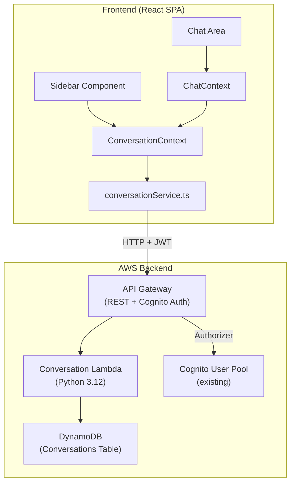

# Design Document: Conversation History

## Overview

> **Implementation Notes (Final Implemented State)**
>
> The following describes the actual shipped behavior:
>
> - **Messages are saved immediately on send** — the `handleSendMessage` flow saves the user message to the API right after dispatch, and the assistant message is saved when the agent response arrives. This is not a `useEffect` auto-save or polling approach.
> - **Multiple concurrent requests supported** — each conversation has its own `AbortController` tracked via a `Map<string, AbortController>`. Starting a new conversation creates a new controller without aborting the previous one.
> - **Switching conversations does NOT cancel in-flight requests** — when the user switches to a different conversation, any in-flight agent request for the previous conversation continues running in the background.
> - **Background save to correct conversation** — when an agent response arrives after the user has already switched away, the response is saved to the correct (original) conversation via its `conversationId`, not the currently active one.
> - **Session ID equals conversation ID** — the `conversationId` is used directly as the `sessionId` passed to AgentCore, ensuring conversation-level memory continuity.
> - **No `clearMessages()` on new conversation** — creating a new conversation calls `setMessages([])` and `setSessionId(newId)` directly without triggering `clearMessages()` (which would abort the previous in-flight request).

This feature adds persistent conversation history to the CloudOps Agent frontend, enabling users to create, browse, rename, delete, and switch between conversations. Conversations are stored in DynamoDB and accessed via an API Gateway REST API secured with a Cognito authorizer. The frontend Sidebar component is upgraded from a static placeholder to a fully interactive conversation list with CRUD capabilities.

The system is designed to be independent of AgentCore Memory — it manages UI-level conversation data (message display, naming, organization) while the existing AgentCore `sessionId` mechanism continues to handle agent memory/context. The `conversationId` doubles as the `sessionId` passed to the agent runtime, ensuring continuity between the UI and agent context.

### Key Design Decisions

1. **Separate CDK Stack**: A new `ConversationHistoryStack` is added to the existing CDK project to isolate conversation infrastructure from the main agent runtime resources.
2. **Single Lambda Function**: One Lambda handles all CRUD operations, using event-based routing by HTTP method + path. This simplifies deployment and reduces cold-start spread across functions.
3. **Cognito Authorizer on API Gateway**: Reuses the existing Cognito User Pool from `AuthStack` for token-based authorization. The Lambda extracts `userId` (Cognito `sub`) from the authorizer claims.
4. **ConversationContext (new)**: A separate React context manages conversation state, keeping it decoupled from `ChatContext` which handles real-time message sending/agent interaction.
5. **Auto-save on each message**: Messages are persisted via PUT after each user send and agent response, with a single retry on failure.

## Architecture



### Data Flow

1. **List conversations**: Frontend loads → `ConversationContext` calls `GET /conversations` → Lambda queries DDB (userId = caller's sub) → returns metadata list (no messages array)
2. **Load conversation**: User clicks sidebar item → `GET /conversations/{id}` → Lambda returns full record with messages → `ChatContext` renders messages
3. **Send message**: User sends → `ChatContext` dispatches to agent → on success, `ConversationContext` calls `PUT /conversations/{id}` to append both user + assistant messages
4. **Create conversation**: User clicks "New" → `POST /conversations` → Lambda creates record → Frontend sets new active conversation
5. **Delete/Rename**: Standard CRUD via `DELETE` or `PUT` endpoints

## Components and Interfaces

### CDK Infrastructure (`cdk/lib/conversation-history-stack.ts`)

```typescript
interface ConversationHistoryStackProps extends cdk.StackProps {
  userPoolArn: string; // From AuthStack
  userPoolId: string; // From AuthStack
}
```

Resources created:

- **DynamoDB Table** (`CloudOpsConversationsTable`): PAY_PER_REQUEST, with TTL disabled (conversations persist indefinitely)
- **Lambda Function** (`ConversationHandler`): Python 3.12 runtime, 256MB memory, 30s timeout
- **API Gateway REST API** (`ConversationApi`): With Cognito authorizer
- **IAM Role**: Lambda execution role with DynamoDB read/write and CloudWatch Logs

### Lambda Handler (`cdk/lambda/conversations/handler.py`)

Single entry point routing by method + path:

```python
def handler(event, context):
    method = event['httpMethod']
    path = event['resource']
    user_id = event['requestContext']['authorizer']['claims']['sub']
    # Routes:
    # GET    /conversations          → list_conversations(user_id)
    # POST   /conversations          → create_conversation(user_id, body)
    # GET    /conversations/{id}     → get_conversation(user_id, conv_id)
    # PUT    /conversations/{id}     → update_conversation(user_id, conv_id, body)
    # DELETE /conversations/{id}     → delete_conversation(user_id, conv_id)
```

### Frontend Conversation Service (`frontend/src/services/conversationService.ts`)

```typescript
interface ConversationMetadata {
  conversationId: string;
  conversationName: string;
  createdAt: string;
  updatedAt: string;
}

interface ConversationFull extends ConversationMetadata {
  messages: Message[];
}

interface ConversationService {
  listConversations(token: string): Promise<ConversationMetadata[]>;
  createConversation(
    token: string,
    body?: { conversationName?: string },
  ): Promise<ConversationFull>;
  getConversation(
    token: string,
    conversationId: string,
  ): Promise<ConversationFull>;
  updateConversation(
    token: string,
    conversationId: string,
    body: UpdateBody,
  ): Promise<ConversationFull>;
  deleteConversation(token: string, conversationId: string): Promise<void>;
}

type UpdateBody = {
  conversationName?: string;
  messages?: Message[]; // Messages to append
};
```

### Frontend State (`frontend/src/state/ConversationContext.tsx`)

```typescript
interface ConversationState {
  conversations: ConversationMetadata[];
  activeConversationId: string | null;
  isLoadingList: boolean;
  isLoadingConversation: boolean;
  listError: string | null;
  conversationError: string | null;
}

type ConversationAction =
  | { type: "SET_CONVERSATIONS"; payload: ConversationMetadata[] }
  | { type: "SET_ACTIVE"; payload: string }
  | { type: "ADD_CONVERSATION"; payload: ConversationMetadata }
  | { type: "REMOVE_CONVERSATION"; payload: string }
  | { type: "RENAME_CONVERSATION"; payload: { id: string; name: string } }
  | { type: "SET_LOADING_LIST"; payload: boolean }
  | { type: "SET_LOADING_CONVERSATION"; payload: boolean }
  | { type: "SET_LIST_ERROR"; payload: string | null }
  | { type: "SET_CONVERSATION_ERROR"; payload: string | null };

interface ConversationContextValue {
  state: ConversationState;
  loadConversations: () => Promise<void>;
  createConversation: () => Promise<string>; // returns new conversationId
  switchConversation: (id: string) => Promise<void>;
  renameConversation: (id: string, name: string) => Promise<void>;
  deleteConversation: (id: string) => Promise<void>;
  saveMessages: (messages: Message[]) => Promise<void>;
}
```

### Updated Sidebar Component

The `Sidebar` gains:

- List of `ConversationMetadata` items sorted by `updatedAt` desc
- "New Conversation" button at the top
- Per-item actions: rename (inline edit), delete (with confirmation modal)
- Active conversation highlight
- Loading skeleton during fetch
- Error state with retry button

### Integration with ChatContext

`ChatContext` is extended to:

- Accept a `sessionId` setter (from `ConversationContext`) when switching conversations
- Accept pre-loaded messages when loading a conversation
- Trigger auto-save via a callback after each successful send/receive

## Data Models

### DynamoDB Table: `CloudOpsConversationsTable`

| Attribute        | Type   | Key           | Description                               |
| ---------------- | ------ | ------------- | ----------------------------------------- |
| userId           | String | Partition Key | Cognito `sub` claim                       |
| conversationId   | String | Sort Key      | UUID v4, also used as sessionId           |
| conversationName | String | —             | Display name (max 53 chars with ellipsis) |
| messages         | List   | —             | Array of message objects                  |
| createdAt        | String | —             | ISO 8601 timestamp                        |
| updatedAt        | String | —             | ISO 8601 timestamp                        |

**Message object structure within `messages` list:**

```json
{
  "id": "string (UUID)",
  "role": "user | assistant",
  "content": "string",
  "timestamp": 1234567890
}
```

### API Request/Response Models

**POST /conversations — Request:**

```json
{
  "conversationName": "string (optional, defaults to 'New Conversation YYYY-MM-DD')"
}
```

**POST /conversations — Response (201):**

```json
{
  "conversationId": "uuid",
  "conversationName": "New Conversation 2025-01-24",
  "messages": [],
  "createdAt": "2025-01-24T10:00:00.000Z",
  "updatedAt": "2025-01-24T10:00:00.000Z"
}
```

**GET /conversations — Response (200):**

```json
[
  {
    "conversationId": "uuid",
    "conversationName": "How to optimize S3 costs...",
    "createdAt": "2025-01-24T10:00:00.000Z",
    "updatedAt": "2025-01-24T12:30:00.000Z"
  }
]
```

**PUT /conversations/{id} — Request:**

```json
{
  "conversationName": "string (optional)",
  "messages": [
    { "id": "...", "role": "user", "content": "...", "timestamp": 123 }
  ]
}
```

**Error Responses:**

- `400`: Invalid UUID format for conversationId, empty name on rename
- `403`: User attempting to access another user's conversation
- `404`: Conversation not found
- `500`: Internal server error

## Correctness Properties

_A property is a characteristic or behavior that should hold true across all valid executions of a system — essentially, a formal statement about what the system should do. Properties serve as the bridge between human-readable specifications and machine-verifiable correctness guarantees._

### Property 1: Conversation list is sorted and complete

_For any_ set of conversation metadata records returned from the API, the Sidebar SHALL render them in descending order of `updatedAt` timestamp, and every `conversationName` in the source data SHALL appear in the rendered output.

**Validates: Requirements 1.2, 1.3**

### Property 2: Generated conversation IDs are unique

_For any_ N conversations created (where N > 1), all generated `conversationId` values SHALL be distinct valid UUID v4 strings.

**Validates: Requirements 2.3**

### Property 3: Messages displayed in chronological order

_For any_ set of Message objects loaded for a conversation, the Frontend SHALL render them in ascending order of `timestamp` value.

**Validates: Requirements 3.2**

### Property 4: SessionId equals active conversationId

_For any_ conversation switch operation, after completion, the active `sessionId` used for agent invocations SHALL equal the selected conversation's `conversationId`.

**Validates: Requirements 3.3**

### Property 5: Successful rename updates displayed name

_For any_ valid non-empty conversation name submitted by the user, after a successful rename API response, the Sidebar SHALL display that exact name for the corresponding conversation item.

**Validates: Requirements 4.4**

### Property 6: Empty or whitespace-only names are rejected

_For any_ string composed entirely of whitespace characters (including the empty string), submitting it as a rename SHALL be rejected by the Frontend, and the previous `conversationName` SHALL remain unchanged.

**Validates: Requirements 4.5**

### Property 7: Deletion removes conversation from list

_For any_ conversation in the list, after a successful DELETE API response, that conversation's `conversationId` SHALL NOT appear in the Sidebar's rendered conversation list.

**Validates: Requirements 5.4**

### Property 8: Auto-save appends messages and updates timestamp

_For any_ message (user or assistant) added to the active conversation, the system SHALL issue a PUT request to append that message to the conversation record, and the `updatedAt` timestamp on the record SHALL be greater than or equal to the previous `updatedAt` value.

**Validates: Requirements 6.1, 6.2, 6.3**

### Property 9: Stored conversation records have complete schema

_For any_ conversation record stored in DynamoDB, it SHALL contain all required attributes (`userId`, `conversationId`, `conversationName`, `messages`, `createdAt`, `updatedAt`) with `userId` as partition key and `conversationId` as sort key.

**Validates: Requirements 7.1, 7.2, 7.3**

### Property 10: User isolation — cross-user access is forbidden

_For any_ API request, the Lambda SHALL return only records where `userId` matches the requesting user's Cognito `sub`. _For any_ write, update, or delete operation targeting a record owned by a different user, the Lambda SHALL return a 403 Forbidden response.

**Validates: Requirements 8.2, 8.3, 8.4**

### Property 11: Auto-generated conversation name with truncation

_For any_ message content string used as the source for auto-naming: if the string length exceeds 50 characters, the `conversationName` SHALL be the first 50 characters followed by "…" (53 chars total). If the string length is 50 or fewer characters, the `conversationName` SHALL equal the source string exactly.

**Validates: Requirements 9.1, 9.3**

### Property 12: UUID format validation on path parameters

_For any_ string provided as a `{conversationId}` path parameter that does not match the UUID v4 format, the API SHALL return a 400 Bad Request response without processing the request further.

**Validates: Requirements 10.6**

### Property 13: Non-existent conversation returns 404

_For any_ valid UUID provided as a `{conversationId}` that does not exist in the Conversations_Table for the requesting user, the API SHALL return a 404 Not Found response.

**Validates: Requirements 10.7**

## Error Handling

### API Layer (Lambda)

| Error Condition            | HTTP Status | Response Body                                     | Recovery                        |
| -------------------------- | ----------- | ------------------------------------------------- | ------------------------------- |
| Missing/invalid auth token | 401         | `{"message": "Unauthorized"}`                     | Re-authenticate via Cognito     |
| Cross-user access attempt  | 403         | `{"message": "Forbidden"}`                        | None — access denied            |
| Invalid UUID format        | 400         | `{"message": "Invalid conversationId format"}`    | Fix client-side UUID generation |
| Conversation not found     | 404         | `{"message": "Conversation not found"}`           | Refresh conversation list       |
| Empty rename string        | 400         | `{"message": "conversationName cannot be empty"}` | Provide valid name              |
| DynamoDB throttle          | 500         | `{"message": "Internal server error"}`            | Client retries with backoff     |
| Lambda timeout             | 504         | API Gateway timeout                               | Client retries                  |

### Frontend Error Handling

| Scenario                  | Behavior                                | User Impact                                            |
| ------------------------- | --------------------------------------- | ------------------------------------------------------ |
| List fetch fails          | Show error in Sidebar with retry button | Cannot see history; can still chat                     |
| Load conversation fails   | Show error in chat area with retry      | Cannot load old messages                               |
| Create conversation fails | Show toast notification                 | Stays on current conversation                          |
| Rename fails              | Revert name, show toast                 | Name unchanged                                         |
| Delete fails              | Keep item in list, show toast           | Item persists                                          |
| Auto-save fails (1st try) | Silent retry after 2s                   | No user impact                                         |
| Auto-save fails (2nd try) | Non-blocking warning icon               | Messages still visible locally but not persisted       |
| Network offline           | All API calls fail gracefully           | Chat still works (agent via SigV4), but no persistence |

### Retry Strategy

- **Auto-save**: 1 retry after 2-second delay. No exponential backoff (messages are append-only, order matters).
- **List/Load**: Manual retry via user action (button click). No automatic retry to avoid hammering a potentially broken endpoint.
- **Create/Rename/Delete**: No automatic retry. Show error notification and let user re-trigger.

## Testing Strategy

### Unit Tests (Vitest + React Testing Library)

**Frontend Components:**

- Sidebar rendering with various conversation list states (empty, populated, loading, error)
- Conversation item interactions (click to switch, rename flow, delete flow with confirmation)
- ConversationContext state transitions
- Auto-save trigger logic in ChatContext integration

**Service Layer:**

- `conversationService.ts` — mock fetch calls, verify correct URLs, headers, body
- Retry logic for auto-save (mock timers)
- Error transformation and handling

**Lambda Handler (pytest):**

- Route dispatch by HTTP method + path
- Input validation (UUID format, empty names)
- DynamoDB interaction via mocked boto3
- Auto-naming logic (truncation, default naming)
- User isolation enforcement

### Property-Based Tests (fast-check for frontend, Hypothesis for Lambda)

Each property from the Correctness Properties section will be implemented as a property-based test with minimum 100 iterations:

**Frontend (fast-check):**

- Property 1: Sorting invariant on random conversation arrays
- Property 2: UUID uniqueness across generated batches
- Property 3: Message chronological ordering
- Property 5: Rename reflects submitted name
- Property 6: Whitespace rejection
- Property 7: Deletion removes from list

**Lambda (Hypothesis):**

- Property 8: Auto-save appends + timestamp update
- Property 9: Schema completeness
- Property 10: User isolation (cross-user access blocked)
- Property 11: Truncation logic
- Property 12: UUID validation
- Property 13: 404 for non-existent records

Each property test will be tagged:

```
// Feature: conversation-history, Property 1: Conversation list is sorted and complete
```

### Integration Tests

- End-to-end API Gateway → Lambda → DynamoDB CRUD flow
- Cognito authorizer rejects unauthenticated requests (401)
- Cross-user isolation at API level (403)
- API response shapes match contract (no messages in list, full messages in get)

### Configuration

- Property test library: **fast-check** (TypeScript/frontend), **Hypothesis** (Python/Lambda)
- Minimum iterations: **100** per property
- Test runner: **Vitest** (frontend), **pytest** (Lambda)
