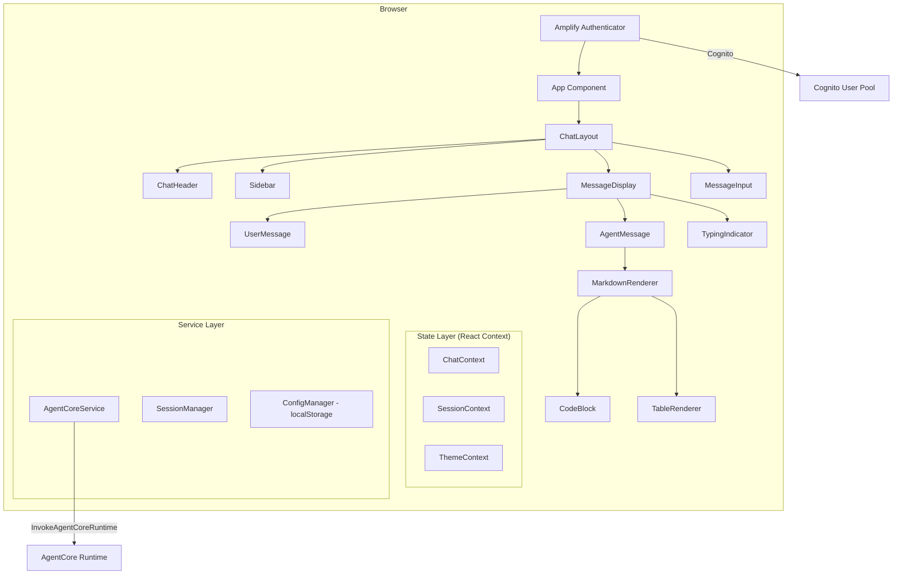
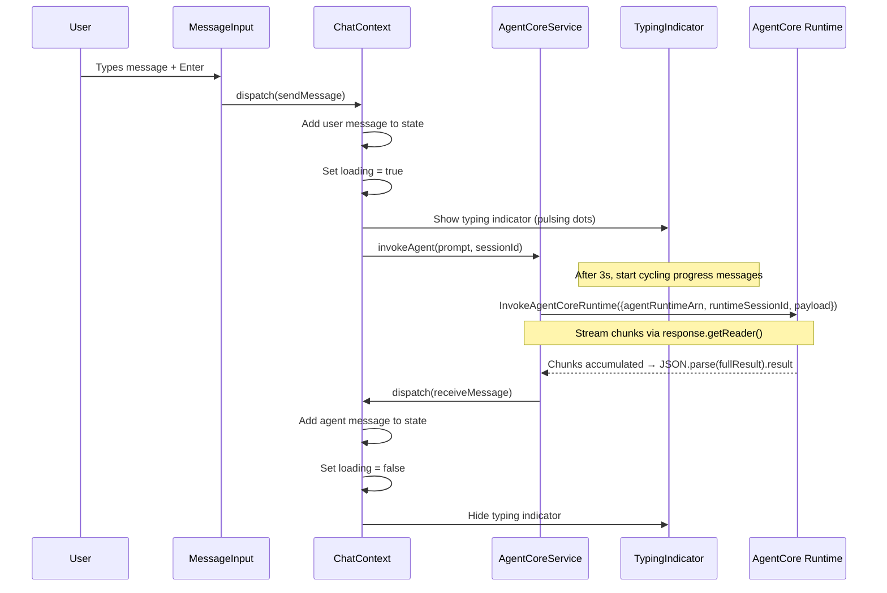

# Design Document: Frontend UI Redesign

## Overview

> **Implementation Notes (Final Implemented State)**
>
> The following describes the actual shipped implementation:
>
> - **Color scheme**: Soft light blue user bubbles (`#e8f0fe`), white agent bubbles, indigo/purple accents throughout
> - **Avatars**: ✦ (sparkle) on purple gradient circle for AI messages, "You" on light indigo circle for user messages
> - **Typing indicator**: "Working..." text with CSS animated ellipsis (no gradient progress bar, no rotating progress messages shown to user — progress messages only update the `aria-label` for accessibility)
> - **Config screen**: Two-column layout — Amazon Cognito settings on the left, AgentCore settings on the right. Conversation History API endpoint field spans full width below.
> - **Login**: Custom branded Amplify Authenticator with gradient background. Header shows ✦ sparkle icon on purple gradient circle, "CloudOps Agent" title, and "Agentic AI powered by Amazon Bedrock AgentCore" subtitle.
> - **Conversation history**: Dark sidebar with create/rename/delete operations, auto-save on message send, multi-conversation support with switching. Active conversation is visually highlighted.
> - **Cancel request**: ■ Stop button replaces send button while a request is in-flight
> - **Sign out**: Button in the header alongside settings gear icon

This design document describes the technical architecture for redesigning the CloudOps Agent frontend UI. The redesign replaces the existing `AIConversation` component from `@aws-amplify/ui-react-ai` with custom-built chat components that provide proper typing indicators, progress states, and rich markdown rendering.

### Existing Tech Stack (Preserved)

The current deployed frontend is a **React 18 + Vite** SPA with the following stack that remains unchanged:

- **React 18.3.1** with Vite bundler (produces `index.html` + `assets/` folder)
- **AWS Amplify Auth** — `Authenticator` component from `@aws-amplify/ui-react` for Cognito-based login
- **AWS SDK clients** — `BedrockAgentRuntimeClient`, `LambdaClient`, `BedrockAgentCoreClient`
- **AgentCore invocation** — `InvokeAgentCoreRuntime` command with streaming response via `response.getReader()`
- **Session management** — `agentcore-session-{timestamp}-{random}` format in localStorage
- **Configuration** — `localStorage.getItem("appConfig")` containing region, ARNs, agent names
- **Deployment** — `npm run build` → zip `dist/` folder → upload to AWS Amplify Hosting (static, no SSR)

### What Changes

| Aspect           | Before                                           | After                                     |
| ---------------- | ------------------------------------------------ | ----------------------------------------- |
| Chat UI          | `AIConversation` from `@aws-amplify/ui-react-ai` | Custom components with typing indicators  |
| Loading feedback | Thin CSS gradient bar (no text)                  | Pulsing dots + rotating progress messages |
| Styling          | Amplify UI design system (`awsui_*` classes)     | CSS custom properties theme system        |
| Markdown         | Built-in Amplify rendering                       | `react-markdown` + rehype plugins         |
| Layout           | Single-panel chat                                | Sidebar + responsive layout               |

### Key Design Decisions

1. **Keep React + Vite** — No framework change. Continue producing static `dist/` output for Amplify Hosting.
2. **Keep AWS Amplify Auth** — The `Authenticator` wrapper from `@aws-amplify/ui-react` stays. Cognito credentials flow unchanged.
3. **Keep AgentCore streaming pattern** — The existing `InvokeAgentCoreRuntime` → `getReader()` → accumulate chunks → `JSON.parse(result).result` pattern is preserved. Since the final text is only available after ALL chunks arrive and JSON is parsed, we use **client-side typing simulation** for perceived responsiveness.
4. **Keep localStorage config** — The `appConfig` pattern in localStorage remains the configuration source.
5. **Replace AIConversation component** — Build custom `MessageDisplay`, `TypingIndicator`, and `MessageInput` components.
6. **CSS Modules + CSS Custom Properties** — Scoped styling with a centralized theme via custom properties (no Amplify UI `awsui_*` classes).
7. **React Context for state** — Lightweight state management via `useReducer` + Context. No Redux needed for this shallow state graph.
8. **react-markdown + rehype-sanitize** — Proven markdown rendering with XSS protection and syntax highlighting.
9. **TypeScript** — Type safety for component props, state, and API contracts.

---

## Architecture



### Data Flow (Message Send → Response)



### AgentCore Invocation Pattern (Preserved)

The existing invocation pattern is kept intact. The service layer wraps it:

```typescript
// services/agentCore.ts — wraps existing pattern
import { BedrockAgentCoreClient, InvokeAgentCoreRuntime } from "@aws-sdk/client-bedrock-agent-core";

export async function invokeAgent(
  prompt: string,
  sessionId: string,
  config: AppConfig,
  signal?: AbortSignal
): Promise<string> {
  const client = new BedrockAgentCoreClient({
    region: config.region,
    credentials: /* from Amplify Auth session */
  });

  const command = new InvokeAgentCoreRuntime({
    agentRuntimeArn: config.agentRuntimeArn,
    runtimeSessionId: sessionId,
    payload: JSON.stringify({ prompt }),
  });

  const response = await client.send(command);
  const reader = response.response.getReader();
  const decoder = new TextDecoder();
  let result = '';
  let done = false;

  while (!done) {
    if (signal?.aborted) throw new DOMException('Aborted', 'AbortError');
    const { value, done: d } = await reader.read();
    done = d;
    if (value) result += decoder.decode(value, { stream: true });
  }

  const parsed = JSON.parse(result);
  return parsed.result;
}
```

---

## Components and Interfaces

### Component Tree

| Component          | Responsibility                                         | Props                                                      |
| ------------------ | ------------------------------------------------------ | ---------------------------------------------------------- |
| `App`              | Wraps with Amplify `Authenticator` + Context providers | —                                                          |
| `ChatLayout`       | Full-viewport flex layout (sidebar + main)             | —                                                          |
| `ChatHeader`       | Title, user avatar, "New Conversation" button          | `onNewConversation: () => void`                            |
| `Sidebar`          | Navigation panel, collapsible on mobile                | `isOpen: boolean; onClose: () => void`                     |
| `MessageDisplay`   | Scrollable message list, auto-scroll logic             | `messages: Message[]`                                      |
| `UserMessage`      | Right-aligned user bubble with avatar                  | `message: Message`                                         |
| `AgentMessage`     | Left-aligned agent bubble with markdown                | `message: Message`                                         |
| `TypingIndicator`  | Pulsing dots + progress state text                     | `progressMessage?: string`                                 |
| `MessageInput`     | Auto-expanding textarea + send button                  | `onSend: (text: string) => void; disabled: boolean`        |
| `MarkdownRenderer` | Sanitized markdown rendering                           | `content: string`                                          |
| `CodeBlock`        | Syntax-highlighted code with copy button               | `code: string; language?: string`                          |
| `ErrorMessage`     | Inline error with retry/cancel buttons                 | `error: string; onRetry: () => void; onCancel: () => void` |
| `ScrollToBottom`   | Floating button when user scrolls up                   | `onClick: () => void`                                      |

### Key Interfaces (TypeScript)

```typescript
// Message types
interface Message {
  id: string;
  role: "user" | "agent";
  content: string;
  timestamp: number;
  status: "sent" | "delivered" | "error";
  errorMessage?: string;
}

// Chat state
interface ChatState {
  messages: Message[];
  isLoading: boolean;
  progressMessage: string | null;
  error: { message: string; originalPrompt: string } | null;
}

// Chat context actions
type ChatAction =
  | { type: "SEND_MESSAGE"; payload: { content: string } }
  | { type: "RECEIVE_MESSAGE"; payload: { content: string } }
  | { type: "SET_LOADING"; payload: boolean }
  | { type: "SET_PROGRESS"; payload: string | null }
  | {
      type: "SET_ERROR";
      payload: { message: string; originalPrompt: string } | null;
    }
  | { type: "CLEAR_MESSAGES" }
  | { type: "RETRY_MESSAGE"; payload: { originalPrompt: string } };

// Session state — preserves existing localStorage pattern
interface SessionState {
  sessionId: string; // format: agentcore-session-{timestamp}-{random}
  userId: string; // from Cognito authenticated user
}

// App config — read from localStorage("appConfig")
interface AppConfig {
  region: string;
  agentRuntimeArn: string;
  agentName: string;
  // Additional fields from existing config
}

// API response from AgentCore (after JSON.parse of stream)
interface AgentCoreResponse {
  result: string; // May contain markdown
  sessionId: string;
  userId: string;
}

// Theme tokens exposed as CSS custom properties
interface ThemeTokens {
  colorPrimary: string;
  colorSidebarBg: string;
  colorChatBg: string;
  colorUserBubble: string;
  colorAgentBubble: string;
  colorText: string;
  colorTextSecondary: string;
  colorBorder: string;
  colorError: string;
  fontFamily: string;
  fontSizeHeading: string;
  fontSizeBody: string;
  fontSizeMeta: string;
  spacingUnit: string; // 8px base
  radiusMd: string;
  radiusLg: string;
}
```

### Typing Indicator & Progress State Logic

The typing indicator is purely client-side because the AgentCore response is only usable after all stream chunks are received and JSON-parsed. There is no way to display partial text.

```typescript
// hooks/useProgressState.ts
const PROGRESS_MESSAGES = [
  "Analyzing your request...",
  "Querying AWS services...",
  "Processing results...",
  "Generating response...",
  "Almost there...",
];

const PROGRESS_DELAY_MS = 3000; // Show progress after 3s
const CYCLE_INTERVAL_MS = 4000; // Change message every 4s

export function useProgressState(isLoading: boolean) {
  const [progressMessage, setProgressMessage] = useState<string | null>(null);
  const [messageIndex, setMessageIndex] = useState(0);

  useEffect(() => {
    if (!isLoading) {
      setProgressMessage(null);
      setMessageIndex(0);
      return;
    }

    const delayTimer = setTimeout(() => {
      setProgressMessage(PROGRESS_MESSAGES[0]);

      const cycleTimer = setInterval(() => {
        setMessageIndex((prev) => {
          const next = (prev + 1) % PROGRESS_MESSAGES.length;
          setProgressMessage(PROGRESS_MESSAGES[next]);
          return next;
        });
      }, CYCLE_INTERVAL_MS);

      return () => clearInterval(cycleTimer);
    }, PROGRESS_DELAY_MS);

    return () => clearTimeout(delayTimer);
  }, [isLoading]);

  return progressMessage;
}
```

### Session Management (Preserves Existing Pattern)

The existing app uses `agentcore-session-{timestamp}-{random}` stored in localStorage. We preserve this format while adding UUID v4 support for the internal chat session tracking:

```typescript
// services/session.ts
import { v4 as uuidv4 } from "uuid";

const SESSION_KEY = "agentcore-session-id";

export function getOrCreateSession(): string {
  let sessionId = sessionStorage.getItem(SESSION_KEY);
  if (!sessionId) {
    const timestamp = Date.now();
    const random = Math.random().toString(36).substring(2, 8);
    sessionId = `agentcore-session-${timestamp}-${random}`;
    sessionStorage.setItem(SESSION_KEY, sessionId);
  }
  return sessionId;
}

export function resetSession(): string {
  const timestamp = Date.now();
  const random = Math.random().toString(36).substring(2, 8);
  const newSessionId = `agentcore-session-${timestamp}-${random}`;
  sessionStorage.setItem(SESSION_KEY, newSessionId);
  return newSessionId;
}

export function getAppConfig(): AppConfig {
  const raw = localStorage.getItem("appConfig");
  if (!raw) throw new Error("App configuration not found in localStorage");
  return JSON.parse(raw);
}
```

### MessageInput Auto-Expand Logic

```typescript
// components/MessageInput.tsx
const MIN_ROWS = 1;
const MAX_ROWS = 5;
const MAX_CHARS = 2000;

function MessageInput({ onSend, disabled }: MessageInputProps) {
  const [value, setValue] = useState('');
  const textareaRef = useRef<HTMLTextAreaElement>(null);

  const handleChange = (e: ChangeEvent<HTMLTextAreaElement>) => {
    const newValue = e.target.value;
    if (newValue.length <= MAX_CHARS) {
      setValue(newValue);
      autoResize();
    }
  };

  const autoResize = () => {
    const el = textareaRef.current;
    if (!el) return;
    el.style.height = 'auto';
    const lineHeight = parseInt(getComputedStyle(el).lineHeight);
    const maxHeight = lineHeight * MAX_ROWS;
    el.style.height = `${Math.min(el.scrollHeight, maxHeight)}px`;
    el.style.overflowY = el.scrollHeight > maxHeight ? 'auto' : 'hidden';
  };

  const handleKeyDown = (e: KeyboardEvent<HTMLTextAreaElement>) => {
    if (e.key === 'Enter' && !e.shiftKey && canSubmit) {
      e.preventDefault();
      submit();
    }
  };

  const canSubmit = value.trim().length > 0 && !disabled;

  const submit = () => {
    if (!canSubmit) return;
    onSend(value.trim());
    setValue('');
    if (textareaRef.current) textareaRef.current.style.height = 'auto';
  };

  return (/* textarea + send button with aria-label */);
}
```

### Auto-Scroll Logic

```typescript
// hooks/useAutoScroll.ts
export function useAutoScroll(messages: Message[], isLoading: boolean) {
  const containerRef = useRef<HTMLDivElement>(null);
  const [isUserScrolledUp, setIsUserScrolledUp] = useState(false);

  const handleScroll = () => {
    const el = containerRef.current;
    if (!el) return;
    const threshold = 100;
    const atBottom =
      el.scrollHeight - el.scrollTop - el.clientHeight < threshold;
    setIsUserScrolledUp(!atBottom);
  };

  useEffect(() => {
    if (!isUserScrolledUp) {
      containerRef.current?.scrollTo({
        top: containerRef.current.scrollHeight,
        behavior: "smooth",
      });
    }
  }, [messages, isLoading, isUserScrolledUp]);

  const scrollToBottom = () => {
    containerRef.current?.scrollTo({
      top: containerRef.current.scrollHeight,
      behavior: "smooth",
    });
    setIsUserScrolledUp(false);
  };

  return { containerRef, isUserScrolledUp, handleScroll, scrollToBottom };
}
```

---

## Data Models

### State Shape

```typescript
// Global state managed via React Context + useReducer
interface AppState {
  chat: ChatState;
  session: SessionState;
  ui: UIState;
}

interface ChatState {
  messages: Message[];
  isLoading: boolean;
  progressMessage: string | null;
  error: { message: string; originalPrompt: string } | null;
}

interface SessionState {
  sessionId: string; // agentcore-session-{timestamp}-{random}, in sessionStorage
  userId: string; // From Cognito auth (Amplify Auth user sub)
}

interface UIState {
  sidebarOpen: boolean;
  isUserScrolledUp: boolean;
}
```

### Message Model

```typescript
interface Message {
  id: string; // UUID v4, generated client-side
  role: "user" | "agent";
  content: string; // Raw text (user) or markdown (agent)
  timestamp: number; // Date.now() at creation
  status: "sent" | "delivered" | "error";
  errorMessage?: string;
}
```

### API Request/Response (AgentCore)

```typescript
// What gets sent to InvokeAgentCoreRuntime
interface AgentCoreRequest {
  agentRuntimeArn: string; // From appConfig
  runtimeSessionId: string; // Session ID
  payload: string; // JSON.stringify({ prompt })
}

// What the stream resolves to after JSON.parse
interface AgentCoreResult {
  result: string; // Agent's response text (may contain markdown)
  sessionId: string;
  userId: string;
}
```

### Configuration (localStorage)

```typescript
// Read from localStorage.getItem("appConfig")
interface AppConfig {
  region: string; // e.g. "us-east-1"
  agentRuntimeArn: string; // ARN for InvokeAgentCoreRuntime
  agentName: string; // Display name in UI
  userPoolId?: string; // Cognito User Pool ID
  userPoolClientId?: string; // Cognito Client ID
  identityPoolId?: string; // Cognito Identity Pool
}
```

### Theme Data Model (CSS Custom Properties)

```css
:root {
  /* Colors */
  --color-primary: #2563eb;
  --color-sidebar-bg: #1e1e2e; /* luminance < 30% */
  --color-chat-bg: #f8fafc; /* luminance > 85% */
  --color-user-bubble: #2563eb;
  --color-agent-bubble: #ffffff;
  --color-text: #1e293b;
  --color-text-secondary: #64748b;
  --color-border: #e2e8f0;
  --color-error: #dc2626;

  /* Typography */
  --font-family: "Inter", -apple-system, BlinkMacSystemFont, sans-serif;
  --font-size-heading: 20px;
  --font-size-body: 15px;
  --font-size-meta: 12px;

  /* Spacing (8px base) */
  --space-1: 8px;
  --space-2: 16px;
  --space-3: 24px;
  --space-4: 32px;
  --space-5: 40px;
  --space-6: 48px;

  /* Radii */
  --radius-sm: 4px;
  --radius-md: 8px;
  --radius-lg: 16px;

  /* Layout */
  --sidebar-width: 260px;
  --max-message-width: 768px;
  --header-height: 64px;
  --input-area-min-height: 64px;
}
```

### Responsive Breakpoints

| Breakpoint | Sidebar Behavior                          | Layout                      |
| ---------- | ----------------------------------------- | --------------------------- |
| ≥ 1024px   | Visible, fixed aside                      | Sidebar + Chat side by side |
| < 1024px   | Collapsed to hamburger, slides as overlay | Chat fills viewport         |

---

## Correctness Properties

_A property is a characteristic or behavior that should hold true across all valid executions of a system — essentially, a formal statement about what the system should do. Properties serve as the bridge between human-readable specifications and machine-verifiable correctness guarantees._

### Property 1: Textarea height is bounded by line count

_For any_ text input containing N newlines where N < 5, the textarea height SHALL accommodate exactly N+1 visible lines; _for any_ text with N ≥ 5 newlines, the textarea height SHALL be capped at 5 lines with vertical scrolling enabled.

**Validates: Requirements 2.1**

### Property 2: Non-whitespace input submits on Enter

_For any_ string containing at least one non-whitespace character, pressing Enter (without Shift) SHALL trigger submission with the trimmed value and clear the input field to empty.

**Validates: Requirements 2.2**

### Property 3: Whitespace-only input prevents submission

_For any_ string composed entirely of whitespace characters (spaces, tabs, newlines) or the empty string, the send button SHALL be disabled and Enter keypress SHALL not trigger submission.

**Validates: Requirements 2.4**

### Property 4: Character limit enforcement

_For any_ string of length greater than 2000 characters, the Message_Input value SHALL never exceed 2000 characters — additional character entry is rejected.

**Validates: Requirements 2.7**

### Property 5: Progress state cycling with accessible label

_For any_ elapsed time T (in milliseconds) where T > 3000 and the request is still in progress, the displayed progress message SHALL equal `MESSAGES[floor((T - 3000) / 4000) % MESSAGES.length]`, and the corresponding `aria-label` on the loading indicator SHALL match this message text.

**Validates: Requirements 3.5, 7.6**

### Property 6: Heading size hierarchy

_For any_ markdown content containing headings at levels h1 through h6, the rendered font size for level N SHALL be strictly greater than the rendered font size for level N+1.

**Validates: Requirements 4.1**

### Property 7: List indentation increases with nesting depth

_For any_ markdown list with nesting depth D (where 1 ≤ D ≤ 4), the rendered left indentation at depth D SHALL be strictly greater than at depth D-1, with a consistent increment between levels.

**Validates: Requirements 4.2**

### Property 8: Table rows have alternating backgrounds

_For any_ rendered markdown table with N rows (N ≥ 2), even-indexed rows SHALL have a different background color than odd-indexed rows.

**Validates: Requirements 4.6**

### Property 9: Links open in new tab

_For any_ markdown content containing hyperlinks, every rendered anchor element SHALL have `target="_blank"` and `rel="noopener noreferrer"` attributes.

**Validates: Requirements 4.7**

### Property 10: HTML sanitization

_For any_ string containing HTML tags (including `<script>`, `<iframe>`, ``, `<a onclick>`, or any raw HTML element), the rendered output SHALL NOT contain those raw HTML elements or event handler attributes — they are stripped before display.

**Validates: Requirements 4.9**

### Property 11: Malformed markdown graceful degradation

_For any_ string input (including invalid/malformed markdown syntax, random binary characters, or empty string), the Markdown_Renderer SHALL produce a non-empty DOM output without throwing an exception.

**Validates: Requirements 4.10**

### Property 12: Session IDs follow the expected format

_For any_ session identifier generated by the Session_Manager, the value SHALL match the pattern `agentcore-session-{digits}-{alphanumeric}` and be a non-empty string.

**Validates: Requirements 5.1**

### Property 13: Every API request includes session and user identifiers

_For any_ message sent through the AgentCoreService, the request payload SHALL contain a non-empty `runtimeSessionId` field and a non-empty stringified JSON body with a `prompt` field, matching the current session state values.

**Validates: Requirements 5.2**

### Property 14: Color contrast meets WCAG thresholds

_For all_ text/background color pairs defined in the theme system, normal-size text (below 18pt) SHALL have a contrast ratio ≥ 4.5:1, and large text (18pt and above) SHALL have a contrast ratio ≥ 3:1.

**Validates: Requirements 7.8**

---

## Error Handling

### Error Categories

| Category         | Trigger                                       | User-Facing Behavior                                                             | Recovery                                |
| ---------------- | --------------------------------------------- | -------------------------------------------------------------------------------- | --------------------------------------- |
| Network Error    | Fetch/stream fails (no response)              | "Unable to reach the server. Check your connection." + retry button              | Retry resubmits original message        |
| Timeout          | No response within 60s                        | "Request timed out. The agent may be processing a complex query." + retry/cancel | Retry resubmits; cancel returns to idle |
| Server Error     | Stream error or malformed JSON response       | "Something went wrong on our end. Please try again." + retry button              | Retry resubmits original message        |
| Auth Error       | Cognito session expired                       | Amplify Authenticator handles re-login automatically                             | User re-authenticates                   |
| Validation Error | Empty/whitespace input                        | Send button disabled; no submission                                              | User types valid content                |
| Abort Error      | User clicks "New Conversation" during request | Request cancelled silently; chat cleared                                         | User starts fresh conversation          |

### Error State Management

```typescript
// Error handling in chat reducer
case 'SET_ERROR':
  return {
    ...state,
    isLoading: false,
    progressMessage: null,
    error: action.payload,  // { message, originalPrompt }
  };

case 'RETRY_MESSAGE':
  return {
    ...state,
    error: null,
    isLoading: true,
    // originalPrompt is re-dispatched to AgentCore service
  };
```

### AbortController Pattern for Stream Reading

Every AgentCore invocation is wrapped with an `AbortController`. The "New Conversation" button and component unmount both call `controller.abort()`. The stream reader checks `signal.aborted` between chunk reads.

```typescript
const abortControllerRef = useRef<AbortController | null>(null);

const sendMessage = async (prompt: string) => {
  abortControllerRef.current?.abort();
  const controller = new AbortController();
  abortControllerRef.current = controller;

  try {
    const result = await invokeAgent(
      prompt,
      sessionId,
      appConfig,
      controller.signal,
    );
    // handle success — dispatch RECEIVE_MESSAGE
  } catch (err) {
    if (err.name === "AbortError") return; // Silent — user initiated
    // Display error to user — dispatch SET_ERROR
  }
};
```

### Timeout Handling

A 60-second client-side timeout is implemented via `AbortController` with `setTimeout`. If the timer fires before all stream chunks are received:

1. The stream read loop is aborted
2. The typing indicator and progress states are removed
3. A timeout notification replaces them with retry and cancel buttons
4. The original prompt is preserved in error state for retry

---

## Testing Strategy

### Testing Pyramid

```
         ╱╲
        ╱  ╲      E2E (Playwright) — 5-10 critical paths
       ╱────╲
      ╱      ╲    Integration — component interactions, API mocking
     ╱────────╲
    ╱          ╲   Unit + Property — pure logic, reducers, utilities
   ╱────────────╲
```

### Unit Tests (Vitest + React Testing Library)

- **Scope**: Component rendering, reducer logic, utility functions
- **Focus**: Specific examples, edge cases, error conditions
- **Tools**: Vitest, @testing-library/react, @testing-library/user-event
- **Coverage targets**: Reducers (100%), utility functions (100%), components (90%+)

### Property-Based Tests (fast-check)

- **Library**: `fast-check` (JavaScript property-based testing library)
- **Configuration**: Minimum 100 iterations per property
- **Scope**: Input validation, markdown sanitization, session ID generation, state transitions, progress cycling logic
- **Tagging**: Each test tagged with `Feature: frontend-ui-redesign, Property N: <description>`

Example property test structure:

```typescript
import fc from "fast-check";

// Feature: frontend-ui-redesign, Property 3: Whitespace-only input prevents submission
test("whitespace-only input prevents submission", () => {
  fc.assert(
    fc.property(
      fc.stringOf(fc.constantFrom(" ", "\t", "\n", "\r")),
      (whitespaceStr) => {
        const canSubmit = whitespaceStr.trim().length > 0;
        expect(canSubmit).toBe(false);
      },
    ),
    { numRuns: 100 },
  );
});

// Feature: frontend-ui-redesign, Property 10: HTML sanitization
test("HTML tags are stripped from rendered output", () => {
  fc.assert(
    fc.property(
      fc.tuple(
        fc.lorem({ maxCount: 5 }),
        fc.constantFrom(
          "<script>",
          "<iframe>",
          '',
          '<div onclick="x">',
        ),
      ),
      ([text, tag]) => {
        const input = `${text} ${tag} ${text}`;
        const output = sanitizeMarkdown(input);
        expect(output).not.toContain(tag);
      },
    ),
    { numRuns: 200 },
  );
});

// Feature: frontend-ui-redesign, Property 5: Progress state cycling
test("progress message matches expected cycling formula", () => {
  fc.assert(
    fc.property(fc.integer({ min: 3001, max: 120000 }), (elapsedMs) => {
      const expectedIndex =
        Math.floor((elapsedMs - 3000) / 4000) % PROGRESS_MESSAGES.length;
      const expectedMessage = PROGRESS_MESSAGES[expectedIndex];
      const actualMessage = computeProgressMessage(elapsedMs);
      expect(actualMessage).toBe(expectedMessage);
    }),
    { numRuns: 100 },
  );
});
```

### Integration Tests

- **Scope**: Component interactions with mocked AgentCore responses, state flow
- **Tools**: Vitest + MSW (Mock Service Worker) or custom fetch mocks
- **Key scenarios**:
  - Full message send → typing indicator → stream complete → response display
  - Error → retry flow
  - Timeout → retry/cancel flow
  - New conversation clears state and aborts in-flight stream

### E2E Tests (Playwright)

- **Scope**: Critical user journeys on deployed app
- **Key paths**:
  - Login via Amplify Authenticator → send message → receive response → verify markdown
  - Session persistence within tab, cleared on refresh
  - Responsive layout at different viewport widths
  - Keyboard navigation flow

### Accessibility Testing

- **Automated**: axe-core integration in unit tests (`jest-axe`)
- **Manual**: Screen reader testing (VoiceOver, NVDA) for aria-live announcements
- **Contrast**: Automated contrast ratio verification against theme tokens

### Deployment & Build Verification

- **Build check**: `npm run build` produces `dist/index.html` + `dist/assets/` with no errors
- **Bundle size**: Monitor bundle size to keep initial load under 500KB gzipped
- **Deployment model**: zip `dist/` folder → upload to AWS Amplify Hosting (no SSR, no Amplify CLI build pipeline)

### Test File Organization

```
src/
├── components/
│   ├── MessageInput/
│   │   ├── MessageInput.tsx
│   │   ├── MessageInput.module.css
│   │   └── MessageInput.test.tsx        # Unit + property tests
│   ├── MarkdownRenderer/
│   │   ├── MarkdownRenderer.tsx
│   │   └── MarkdownRenderer.test.tsx    # Unit + property tests (sanitization)
│   └── TypingIndicator/
│       ├── TypingIndicator.tsx
│       └── TypingIndicator.test.tsx     # Unit tests
├── hooks/
│   ├── useProgressState.ts
│   └── useProgressState.test.ts         # Property tests (cycling logic)
├── services/
│   ├── agentCore.ts                     # AgentCore invocation (stream reader)
│   ├── agentCore.test.ts                # Integration tests
│   ├── session.ts
│   └── session.test.ts                  # Property tests (session ID format)
├── state/
│   ├── chatReducer.ts
│   └── chatReducer.test.ts             # Unit + property tests
└── __tests__/
    └── integration/                     # Full-flow integration tests
```
