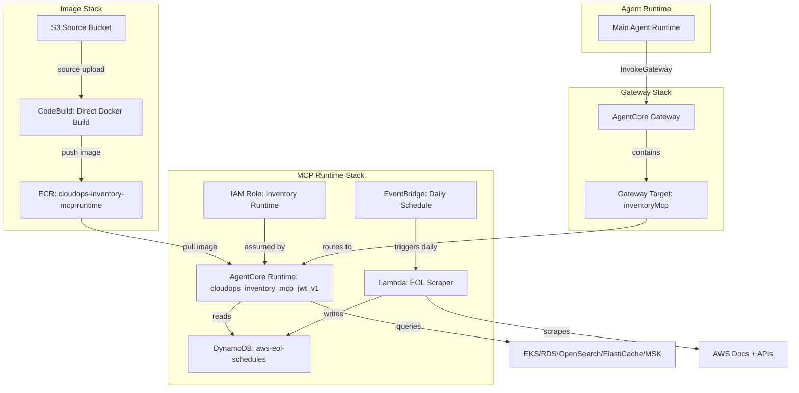

# Design Document: Inventory MCP Server

## Overview

This design integrates an inventory MCP server into the existing CloudOps Agent architecture. The inventory server provides tools for querying AWS managed service clusters (EKS, RDS, OpenSearch, ElastiCache, MSK) with version information, operational status, and end-of-support schedules sourced from a DynamoDB table.

The deployment follows the established AgentCore Runtime pattern but with key differences from existing MCP servers (CloudWatch, CloudTrail):

1. **No transform script** — the inventory source is local, so Docker builds directly from `mcp-servers/inventory/`
2. **DynamoDB table** — stores end-of-support schedule data, either created by CDK or referenced by name
3. **Scheduled Lambda** — an EOL scraper runs daily via EventBridge to refresh DynamoDB data

The architecture reuses the existing 5-stack deployment (Image → Auth → MCPRuntime → Gateway → AgentRuntime) by extending the Image, MCPRuntime, and Gateway stacks with inventory-specific resources.

## Architecture



## Components and Interfaces

### 1. Image Stack Extensions (`cdk/lib/image-stack.ts`)

**New resources:**

- `inventoryMcpRepository: ecr.Repository` — ECR repo named `cloudops-inventory-mcp-runtime`
- `InventoryMcpBuildProject: codebuild.Project` — direct Docker build (no transform)
- S3 deployment of `mcp-servers/inventory/` source
- Build trigger + waiter custom resources

**Key difference from existing servers:** Uses `buildMainRuntimeImage`-style direct Docker build rather than `createTransformBuildProject`, since there's no upstream repo to clone/transform. The buildspec is self-contained with simple `docker build` from source.

**Public property:**

```typescript
public readonly inventoryMcpRepository: ecr.Repository;
```

### 2. MCP Runtime Stack Extensions (`cdk/lib/mcp-runtime-stack.ts`)

**New props interface addition:**

```typescript
inventoryMcpRepository: ecr.IRepository;
eolTableName?: string; // Optional: use existing table
```

**New resources:**

- `InventoryMcpRuntimeRole: iam.Role` — assumed by `bedrock-agentcore.amazonaws.com`
- DynamoDB table (conditional) — `aws-eol-schedules`, PK=`service`, SK=`version`, PAY_PER_REQUEST
- `AWS::BedrockAgentCore::Runtime` — `cloudops_inventory_mcp_jwt_v1`
- Lambda function — EOL scraper, Python 3.12, 512 MB, 5-min timeout
- EventBridge rule — `rate(1 day)` trigger

**Public properties:**

```typescript
public readonly inventoryMcpRuntimeArn: string;
public readonly inventoryMcpRuntimeEndpoint: string;
```

### 3. Gateway Stack Extensions (`cdk/lib/gateway-stack.ts`)

**New props interface additions:**

```typescript
inventoryMcpRuntimeArn: string;
inventoryMcpRuntimeEndpoint: string;
```

**New resource:**

- `AWS::BedrockAgentCore::GatewayTarget` — `inventoryMcp` target with OAUTH credential provider

### 4. CDK App Wiring (`cdk/bin/app.ts`)

- Read `EOL_TABLE_NAME` from environment (optional, like `COGNITO_ADMIN_EMAIL`)
- Pass `inventoryMcpRepository` from ImageStack to MCPRuntimeStack
- Pass `inventoryMcpRuntimeArn` and `inventoryMcpRuntimeEndpoint` to GatewayStack

### 5. Inventory MCP Server (`mcp-servers/inventory/`)

**Source structure** (copied from existing `inventory-mcp-agentcore/`):

```
mcp-servers/inventory/
├── Dockerfile
├── pyproject.toml
├── src/inventory_mcp_server/
│   ├── __init__.py
│   ├── server.py
│   ├── aws_client.py
│   ├── eol_reader.py
│   └── tools/
│       ├── eks.py
│       ├── rds.py
│       ├── opensearch.py
│       ├── elasticache.py
│       └── msk.py
└── eol-scraper/
    └── eol_scraper/
        ├── __init__.py
        ├── main.py
        └── scrapers/
            ├── eks.py
            ├── rds.py
            ├── elasticache.py
            ├── opensearch.py
            └── msk.py
```

### 6. Buildspec (`codebuild-scripts/buildspec-inventory.yml`)

Simplified buildspec for direct Docker build — no git clone of upstream repos, no transform scripts:

```yaml
version: 0.2
phases:
  pre_build:
    commands:
      - aws ecr get-login-password --region $AWS_DEFAULT_REGION | docker login --username AWS --password-stdin $AWS_ACCOUNT_ID.dkr.ecr.$AWS_DEFAULT_REGION.amazonaws.com
  build:
    commands:
      - docker build -t $ECR_REPO_URI:$CODEBUILD_BUILD_NUMBER .
      - docker tag $ECR_REPO_URI:$CODEBUILD_BUILD_NUMBER $ECR_REPO_URI:latest
  post_build:
    commands:
      - docker push $ECR_REPO_URI:$CODEBUILD_BUILD_NUMBER
      - docker push $ECR_REPO_URI:latest
```

### 7. Agent System Prompt Update (`agentcore/agent_runtime.py`)

Add inventory capabilities to the system prompt alongside existing billing, pricing, CloudWatch, and CloudTrail sections.

## Data Models

### DynamoDB EOL Table

**Table name:** `aws-eol-schedules` (configurable via `EOL_TABLE_NAME`)

| Attribute                 | Type   | Key           | Description                                                                                               |
| ------------------------- | ------ | ------------- | --------------------------------------------------------------------------------------------------------- |
| `service`                 | String | Partition Key | Service identifier: `eks`, `rds`, `aurora-mysql`, `aurora-postgresql`, `elasticache`, `opensearch`, `msk` |
| `version`                 | String | Sort Key      | Version string (e.g., `1.29`, `8.0.36`, `7.1`)                                                            |
| `end_of_standard_support` | String | —             | ISO date or "Unknown"                                                                                     |
| `end_of_extended_support` | String | —             | ISO date or "Unknown"                                                                                     |
| `status`                  | String | —             | e.g., "current", "deprecated"                                                                             |
| `release_date`            | String | —             | ISO date or empty                                                                                         |
| `source`                  | String | —             | Data source URL                                                                                           |
| `updated_at`              | String | —             | ISO timestamp of last scraper update                                                                      |

**Access patterns:**

- `Query(service = "eks")` — get all version schedules for a service
- `GetItem(service, version)` — get schedule for specific version

### MCP Tool Responses

Each service tool returns structured dicts combining live AWS API data with DynamoDB EOL data:

```python
{
    "name": str,
    "version": str,
    "status": str,
    "arn": str,
    "region": str,
    "end_of_standard_support": str,  # From DynamoDB
    "end_of_extended_support": str,  # From DynamoDB
    # ... service-specific fields
}
```

### EOL Reader Cache

In-memory TTL cache (default 5 minutes, configurable via `EOL_CACHE_TTL`):

```python
_cache: Dict[str, tuple] = {}  # {service: (data_dict, timestamp)}
```

## Correctness Properties

_A property is a characteristic or behavior that should hold true across all valid executions of a system — essentially, a formal statement about what the system should do. Properties serve as the bridge between human-readable specifications and machine-verifiable correctness guarantees._

### Property 1: EOL Data Round-Trip Integrity

_For any_ valid EOL schedule record (with a non-empty service string, non-empty version string, and arbitrary date strings for end_of_standard_support and end_of_extended_support), writing it to DynamoDB via `write_to_dynamodb` and then reading it back via `get_eol_schedule(service)` SHALL return a dict containing that version key with matching end_of_standard_support and end_of_extended_support values.

**Validates: Requirements 3.3, 5.8**

### Property 2: Cache Consistency Within TTL

_For any_ service name queried via `get_eol_schedule(service)`, calling the function a second time within the cache TTL period SHALL return an identical result without issuing a new DynamoDB query.

**Validates: Requirements 4.5**

### Property 3: Multi-Region Cluster Aggregation Completeness

_For any_ set of enabled regions where each region contains zero or more clusters, calling a list tool (e.g., `list_eks_clusters()`) without specifying a region SHALL return results from every enabled region that has clusters, and each result's `region` field SHALL match the region from which the cluster was retrieved.

**Validates: Requirements 4.4**

### Property 4: EOL Enrichment Correctness

_For any_ cluster with a version string, if that version exists as a key in the EOL schedule data for the cluster's service, the tool response SHALL include `end_of_standard_support` and `end_of_extended_support` values matching the DynamoDB record. If the version does NOT exist in the EOL data, both fields SHALL be the string "Unknown".

**Validates: Requirements 4.5, 5.8**

### Property 5: Scraper Deduplication

_For any_ list of scraped EOL records (potentially containing duplicate (service, version) pairs), calling `write_to_dynamodb` SHALL write at most one record per unique (service, version) composite key, with the total number of written records equal to the count of unique keys in the input.

**Validates: Requirements 5.8**

## Error Handling

| Component                                  | Error Scenario                    | Handling                                                                           |
| ------------------------------------------ | --------------------------------- | ---------------------------------------------------------------------------------- |
| `eol_reader.get_eol_schedule()`            | DynamoDB table doesn't exist      | Returns empty dict, logs warning                                                   |
| `eol_reader.get_eol_schedule()`            | Query fails (throttle, network)   | Returns empty dict, logs warning                                                   |
| Tool functions (e.g., `list_eks_clusters`) | Region-specific API failure       | Skips region, continues to next (`except Exception: continue`)                     |
| EOL Scraper `create_table_if_not_exists`   | Table already exists              | No-op (catches `ResourceNotFoundException`)                                        |
| EOL Scraper `write_to_dynamodb`            | Duplicate (service, version) keys | Deduplicates via `seen` set before writing                                         |
| CodeBuild                                  | Docker build fails                | Build marked FAILED, waiter custom resource signals failure, CDK deploy rolls back |
| AgentCore Runtime                          | Container health check fails      | AgentCore restarts container (HEALTHCHECK in Dockerfile)                           |
| Gateway target                             | Runtime unreachable               | Gateway returns error to agent; agent can retry or inform user                     |

## Testing Strategy

### Unit Tests

- **EOL Reader:** Test cache hit/miss behavior, DynamoDB query parsing, fallback on error
- **Tool functions:** Mock boto3 clients, verify response structure includes EOL fields
- **Scraper deduplication:** Verify duplicate (service, version) pairs are written only once
- **AWS client helpers:** Test region resolution, client creation

### Property-Based Tests

Property-based testing applies to the data layer logic (EOL reader, scraper deduplication, tool response enrichment). Use `hypothesis` (Python PBT library) with minimum 100 iterations per property.

- **Property 1 (Round-trip):** Generate random service/version/date combos, write to mock DynamoDB, read back
- **Property 2 (Cache):** Generate service queries, verify cache returns same reference within TTL
- **Property 3 (Multi-region):** Generate random region→cluster mappings, verify aggregation covers all
- **Property 4 (Enrichment):** Generate clusters with versions that may/may not exist in EOL table, verify correct enrichment
- **Property 5 (Deduplication):** Generate lists with duplicate keys, verify unique writes

Each property test is tagged: `# Feature: inventory-mcp-server, Property {N}: {description}`

### Integration Tests

- Deploy CDK stack to test account, verify:
  - ECR repo exists and contains image
  - AgentCore Runtime is ACTIVE
  - Gateway target resolves
  - Lambda executes on schedule and populates DynamoDB
  - MCP tools return expected structure via Gateway

### CDK Tests

- Snapshot tests for synthesized templates
- Assertion tests for IAM policy correctness (least privilege)
- Verify DynamoDB table conditional creation logic
