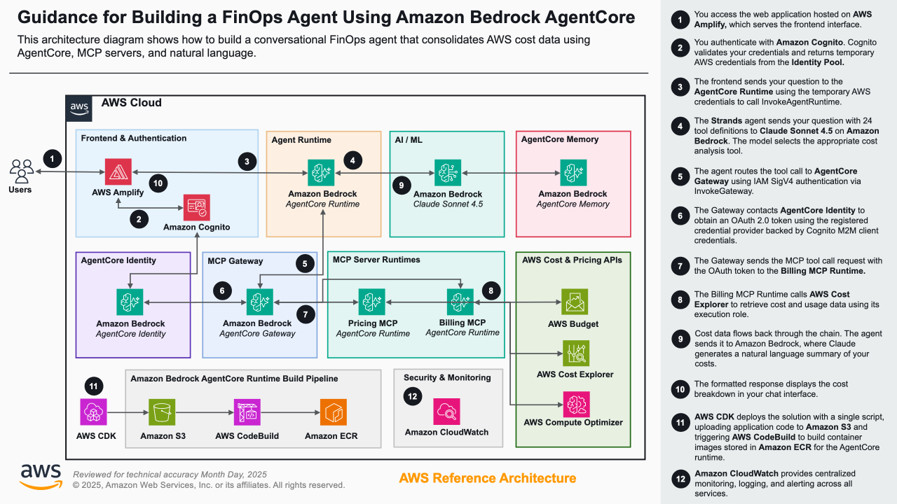
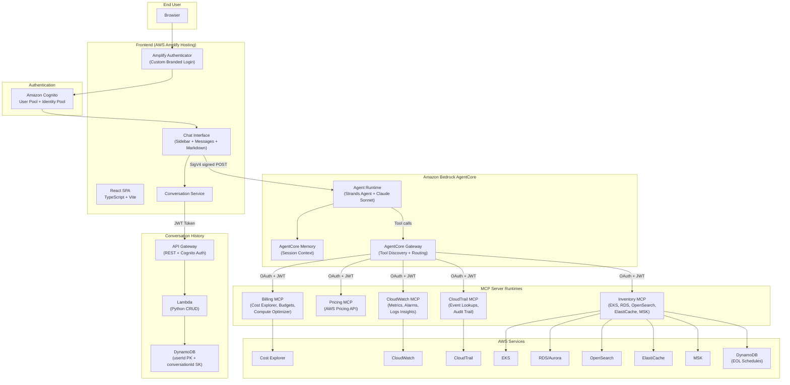
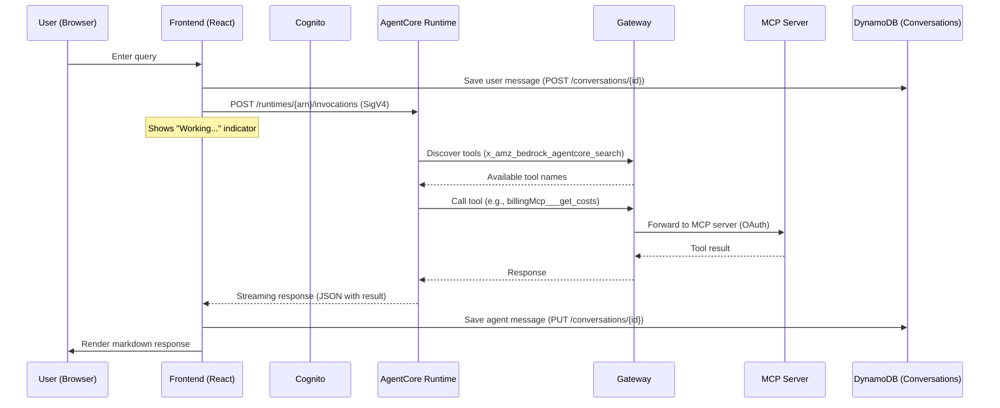

# CloudOps Agent – Agentic AI powered by Amazon Bedrock AgentCore

An AI-powered CloudOps assistant that helps operations and finance teams manage AWS costs, monitor infrastructure health, audit account activity, and track cluster inventory — all through a conversational interface.

## Architecture Overview

The solution has three main components:

| Layer                    | Technology                                                              | Purpose                                            |
| ------------------------ | ----------------------------------------------------------------------- | -------------------------------------------------- |
| **Backend**              | AgentCore Runtime + Strands Agent SDK + MCP tools via AgentCore Gateway | AI agent orchestration and AWS service querying    |
| **Frontend**             | React SPA on AWS Amplify Hosting                                        | Modern chat interface with conversation management |
| **Conversation History** | DynamoDB + API Gateway + Lambda                                         | Persistent, multi-user conversation storage        |



### Detailed Architecture



### Request Flow



## Features

### CloudOps AI Assistant

- **Cost Optimization** — Query AWS Cost Explorer, Budgets, Compute Optimizer, Savings Plans, and cost anomalies
- **CloudWatch Monitoring** — Metrics, alarms, log groups, and Logs Insights queries
- **CloudTrail Auditing** — API activity lookups, trail status, IAM change tracking
- **Cluster Inventory** — EKS, RDS/Aurora, OpenSearch, ElastiCache, MSK with version lifecycle tracking

### MCP Servers

Five Model Context Protocol servers provide 30+ specialized tools:

| Server         | Capabilities                                                                               |
| -------------- | ------------------------------------------------------------------------------------------ |
| **Billing**    | Cost Explorer, Budgets, Compute Optimizer, Savings Plans, Free Tier, Anomalies             |
| **CloudTrail** | Event lookups, trail management, audit queries                                             |
| **CloudWatch** | Metrics, alarms, log groups, Logs Insights queries                                         |
| **Inventory**  | EKS, RDS/Aurora, OpenSearch, ElastiCache, MSK clusters with end-of-support date monitoring |
| **Pricing**    | AWS Pricing API for service comparison                                                     |

### Frontend UI

- Custom login page with branding (gradient background, ✦ sparkle logo, app title)
- Dark sidebar with conversation history (create, rename, delete, switch between conversations)
- "Working..." indicator with animated ellipsis during agent processing
- Rich markdown rendering (tables, code blocks with copy button, nested lists, headings)
- Cancel request (■ Stop button) to abort in-flight agent calls
- Settings configuration (Cognito, AgentCore, Conversation History API endpoint)
- Sign out
- Responsive layout — sidebar collapses to hamburger menu on mobile (< 1024px)
- Avatars: ✦ sparkle on purple gradient for AI, "You" on light indigo for user
- Soft light blue user bubbles (#e8f0fe), white agent bubbles, indigo/purple accents

### Conversation History

- Persistent conversation storage in DynamoDB, scoped per user via Cognito
- Create, rename, delete, and switch between conversations from the sidebar
- Auto-save messages on send (immediate persistence, not polling-based)
- Multi-user isolation — each user only sees their own conversations
- Conversations survive logout/login and work across devices

### Authentication

- Amazon Cognito User Pool + Identity Pool
- Custom branded Amplify Authenticator login page
- Multi-user isolation for all data

## Tech Stack

| Component        | Technology                                   |
| ---------------- | -------------------------------------------- |
| Frontend         | React 18 + TypeScript + Vite                 |
| Infrastructure   | AWS CDK (TypeScript)                         |
| Agent Runtime    | Python (Strands Agent SDK)                   |
| MCP Servers      | Python (hosted on AgentCore Runtime)         |
| Conversation API | Python Lambda + API Gateway + DynamoDB       |
| Auth             | Amazon Cognito                               |
| AI               | Amazon Bedrock (Claude Sonnet) via AgentCore |
| Hosting          | AWS Amplify Hosting (static SPA)             |

## Deployment

### CDK Stacks

Deploy via `npx cdk deploy --all` from the `cdk/` directory. Six stacks are provisioned:

1. **ImageStack** — ECR repositories + CodeBuild projects for container images
2. **AuthStack** — Cognito User Pool, Identity Pool, M2M client, IAM roles
3. **MCPRuntimeStack** — AgentCore Runtimes for Billing, Pricing, CloudWatch, CloudTrail, Inventory MCP servers
4. **AgentCoreGatewayStack** — Unified tool discovery/invocation endpoint with OAuth
5. **AgentRuntimeStack** — Main Strands agent with Gateway integration and AgentCore Memory
6. **ConversationHistoryStack** — DynamoDB table + API Gateway + Lambda for conversation persistence

### Frontend

```bash
cd frontend
npm install
npm run build
npm run zip
```

Upload the generated zip to AWS Amplify Hosting (Deploy without Git provider).

### Configuration

After deploying both backend and frontend:

1. Open the Amplify app URL
2. On first load, the Settings screen appears
3. Configure:
   - **Amazon Cognito**: User Pool ID, User Pool Client ID, Identity Pool ID, Region
   - **AgentCore**: Agent Name, AgentCore Runtime ARN, Region
   - **Conversation History API**: API Gateway endpoint URL (from ConversationHistoryStack output)
4. Save — the app reloads with authentication enabled

## Inventory MCP Server

The Inventory MCP server provides cluster discovery and version lifecycle tracking for:

- **Amazon EKS** — Kubernetes clusters with control plane version
- **Amazon RDS / Aurora** — Database instances and clusters with engine versions
- **Amazon OpenSearch Service** — Domains with engine version
- **Amazon ElastiCache** — Redis/Valkey/Memcached clusters with engine version
- **Amazon MSK** — Kafka clusters with broker version

Each tool enriches live AWS API data with end-of-support schedules from a DynamoDB table (`aws-eol-schedules`), updated daily by a Lambda scraper. This enables queries like:

- "Which of my EKS clusters are running versions approaching end of support?"
- "List all RDS instances and their version lifecycle status"
- "Show me clusters that need version upgrades in the next 90 days"

## Prerequisites

- Node.js 18+ and npm
- Python 3.12+
- AWS CLI v2 configured with credentials
- AWS CDK v2 (`npm install -g aws-cdk`)
- Amazon Bedrock model access enabled (Claude Sonnet)

## Quick Start

```bash
# Get source files and navigate to project
cd cloudops-agent

# Deploy backend
export COGNITO_ADMIN_EMAIL="your-email@example.com"
cd cdk && npm install && npm run build
npx cdk deploy --all --require-approval never

# Build and deploy frontend
cd ../frontend && npm install && npm run build && npm run zip
# Upload cloudops-frontend.zip to AWS Amplify Hosting

# Sign in with admin + temporary password from email
# Configure settings with stack outputs
```

## Sample Queries

| Query                                                 | Category   |
| ----------------------------------------------------- | ---------- |
| "What are my AWS costs for this month?"               | Cost       |
| "What cost savings opportunities do I have?"          | Cost       |
| "Are there any alarms in ALARM state?"                | Monitoring |
| "Who modified the S3 bucket policy yesterday?"        | Audit      |
| "List all my EKS clusters and their version status"   | Inventory  |
| "Which RDS instances are approaching end of support?" | Inventory  |

## Cleanup

```bash
cd cdk
npx cdk destroy --all
```

This removes all CDK stacks including DynamoDB tables (EOL schedules and conversation history), API Gateway, Lambda functions, AgentCore runtimes, and Cognito resources.

Then delete the Frontend UI running on Amplify Hosting:

1. Go to **AWS Amplify** → select your app
2. Click **Actions** → **Delete app**

## Author

- **Nipon Maluengnont** — Technical Account Manager, AWS Enterprise Support
