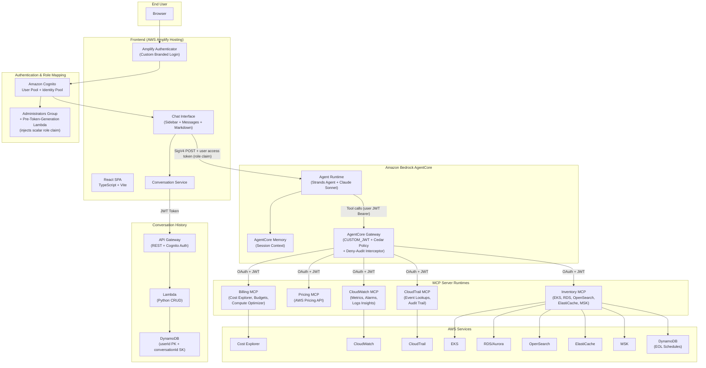
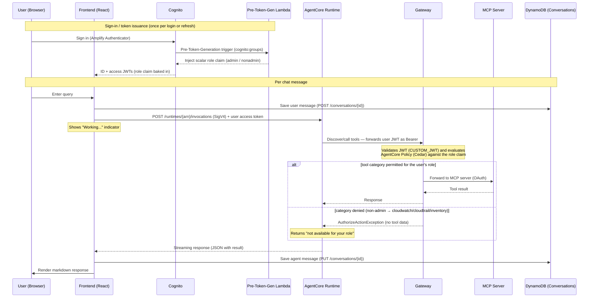

# CloudOps Agent – Agentic AI powered by Amazon Bedrock AgentCore

An AI-powered CloudOps assistant that helps operations and finance teams manage AWS costs, monitor infrastructure health, audit account activity, and track cluster inventory — all through a conversational interface.

## Architecture Overview

The solution has three main components:

| Layer                    | Technology                                                              | Purpose                                            |
| ------------------------ | ----------------------------------------------------------------------- | -------------------------------------------------- |
| **Backend**              | AgentCore Runtime + Strands Agent SDK + MCP tools via AgentCore Gateway | AI agent orchestration and AWS service querying    |
| **Frontend**             | React SPA on AWS Amplify Hosting                                        | Modern chat interface with conversation management |
| **Conversation History** | DynamoDB + API Gateway + Lambda                                         | Persistent, multi-user conversation storage        |

### Detailed Architecture



### Request Flow



#### Step-by-Step Walkthrough

0. **Sign-in & token issuance (happens once per login/refresh, before any query)** — When the user signs in through the Amplify Authenticator, Cognito authenticates them and then synchronously invokes the **Pre-Token-Generation Lambda** trigger. That Lambda reads the user's `cognito:groups` and injects a scalar `role` claim (`"admin"` if in the `Administrators` group, otherwise `"nonadmin"`) into both the ID and access tokens before Cognito signs them. The role is therefore baked into the JWT at issuance — it is **not** computed on the request path below, and it is not a stored user attribute (decode a token to see it). Changing a user's group membership takes effect the next time their tokens are issued or refreshed.
1. **User submits a query** — The user types a question (e.g. "Which RDS instances are approaching end of support?") into the React chat interface and presses send.
2. **Persist the user message** — The frontend immediately saves the user's message to DynamoDB via `POST /conversations/{id}`, so the conversation survives reloads even before the agent responds.
3. **Invoke the agent** — The frontend sends the query to the AgentCore Runtime with a SigV4-signed `POST /runtimes/{arn}/invocations` request, and includes the user's Cognito **access token** (carrying the `role` claim) in the payload. A "Working..." indicator is shown while the request is in flight.
4. **Tool discovery** — The Strands agent in the Runtime discovers tools through the AgentCore Gateway, forwarding the user's token as a Bearer credential. It lists tools via standard MCP `tools/list`, and because the Gateway is configured for **semantic search**, the agent also calls the Gateway's built-in `x_amz_bedrock_agentcore_search` tool to surface tools that aren't immediately visible (CloudWatch, CloudTrail, Inventory, Pricing). Discovery is **not** role-filtered — the full tool catalog across all registered servers (Billing, Pricing, CloudWatch, CloudTrail, Inventory) is visible to every authenticated user. Authorization is enforced at tool **invocation**, not discovery: AgentCore Policy (Cedar) makes the per-user allow/deny decision when a tool is actually called (see [Role-Based Tool Access Control](#role-based-tool-access-control)).
5. **Reasoning and tool selection** — Claude Sonnet reasons over the query and the available tools, then decides which tool(s) to call and with what arguments (e.g. `inventoryMcp___list_rds_instances`).
6. **Tool invocation** — The Runtime calls the chosen tool through the Gateway. The Gateway forwards the request to the appropriate MCP server runtime over an OAuth-authenticated connection.
7. **MCP server queries AWS** — The MCP server calls the relevant AWS APIs (and, for Inventory, enriches results with end-of-support dates read from the `aws-eol-schedules` DynamoDB table) and returns a structured result to the Gateway, which relays it back to the Runtime.
8. **Response synthesis** — The agent may loop through steps 5–7 multiple times if more data is needed, then composes a final natural-language answer (often containing markdown tables or code blocks).
9. **Stream back to the frontend** — The Runtime streams the JSON response back to the frontend, which renders the markdown answer for the user.
10. **Persist the agent message** — The frontend saves the agent's response to DynamoDB via `PUT /conversations/{id}`, completing the conversation turn.

#### Authentication & Authorization

The request path crosses three trust boundaries, each using a different mechanism. No long-lived AWS keys are used anywhere in the flow — every hop relies on short-lived tokens or temporary credentials.

| Hop                           | Mechanism                       | Credential / token                                                                                                                                                                                                                                                      |
| ----------------------------- | ------------------------------- | ----------------------------------------------------------------------------------------------------------------------------------------------------------------------------------------------------------------------------------------------------------------------- |
| User → Frontend               | Cognito User Pool sign-in       | User signs in via the Amplify Authenticator and receives Cognito **ID + access JWTs**. A **Pre-Token-Generation Lambda** injects a scalar `role` claim (`admin`/`nonadmin`) based on `Administrators` group membership                                                  |
| Frontend → Conversation API   | Cognito JWT (API Gateway)       | The Cognito **ID token** is sent as the `Authorization` header; an API Gateway **Cognito User Pools Authorizer** validates it                                                                                                                                           |
| Frontend → AgentCore Runtime  | IAM / SigV4 + forwarded JWT     | The Identity Pool exchanges the authenticated identity for **temporary STS credentials** (the `AuthenticatedRole`) to SigV4-sign `InvokeAgentRuntime`; the user's Cognito **access token** is also conveyed in the payload so the role can reach the Gateway            |
| Runtime → Gateway             | OAuth 2.0 bearer (user JWT)     | The Runtime forwards the user's Cognito access token as a `Bearer` token. The Gateway's authorizer type is **`CUSTOM_JWT`** (validates against the Cognito issuer + `AllowedClients`), then **AgentCore Policy** (Cedar) authorizes the tool by the user's `role` claim |
| Gateway → MCP Server Runtimes | OAuth 2.0 bearer (client creds) | The Gateway exchanges the **M2M client ID + secret** for a Cognito **OAuth access token** (scope `mcp-runtime-server/invoke`) and sends it as a `Bearer` token                                                                                                          |
| MCP Server → AWS service APIs | IAM / SigV4                     | Each MCP Runtime's **own execution role** (read-only scoped) signs the AWS API calls and DynamoDB reads                                                                                                                                                                 |

**Token exchange details:**

1. **User identity (Cognito).** After sign-in, Cognito issues JWTs. The Cognito **Identity Pool** then federates that identity through STS `AssumeRoleWithWebIdentity` to mint **temporary AWS credentials** bound to the `AuthenticatedRole`. That role allows `bedrock-agentcore:InvokeAgentRuntime` (plus `GetRuntime`/`ListRuntimes`) scoped to the `cloudops_*` runtimes — unauthenticated identities are explicitly denied everything.

2. **Two parallel paths from the frontend.** Conversation history calls go to **API Gateway**, which validates the raw **Cognito JWT** (no IAM involved). Agent invocations go to the **AgentCore Runtime** using **SigV4** signed with the temporary credentials, and additionally carry the user's Cognito **access token** in the payload. These are deliberately separate: data persistence is user-scoped via JWT claims, while agent invocation is gated by IAM.

3. **Runtime to Gateway (CUSTOM_JWT + Policy).** The Runtime forwards the user's Cognito access token to the Gateway as a `Bearer` token (it does **not** sign with its own IAM principal for the inbound auth). The Gateway's `CUSTOM_JWT` authorizer validates the token against the Cognito OpenID discovery URL and the `AllowedClients` allowlist (the FrontEnd app client). The verified JWT claims — including the `role` claim — are then evaluated by **AgentCore Policy** (Cedar) to make a per-user allow/deny decision for each tool. If no resolvable user identity reaches the Gateway, the `NonAdmin` role applies by default. See [Role-Based Tool Access Control](#role-based-tool-access-control).

4. **Gateway to MCP servers (OAuth token exchange).** This is the only OAuth hop. Each Gateway target is wired to an **OAuth2 credential provider** backed by a Cognito **machine-to-machine (M2M) app client** using the `client_credentials` grant. The M2M client secret is stored in **Secrets Manager**; AgentCore Identity (`GetResourceOauth2Token` / `GetWorkloadAccessToken`) performs the exchange against the Cognito **token endpoint** and caches the resulting bearer token. The Gateway attaches that token to each MCP request.

5. **MCP server JWT validation.** Every MCP Runtime is deployed with a `CustomJWTAuthorizer` configured with the Cognito **OpenID discovery URL** and an `AllowedClients` allowlist containing the M2M client ID. It validates the incoming bearer token's signature (against Cognito's JWKS), issuer, and client ID before serving any tool call.

6. **MCP server to AWS (least privilege).** Once authorized, the MCP server uses **its own runtime execution role** to call AWS — these roles are read-only and tightly scoped (e.g. the Inventory role grants only `eks:*`/`rds:Describe*`/`es:*`/`elasticache:*`/`kafka:*` describe-style actions plus `dynamodb:GetItem`/`Query`/`Scan` on the EOL table). The EOL scraper Lambda runs under a separate role with write access to the EOL table and the `Describe*Versions` APIs.

## Role-Based Tool Access Control

The Gateway enforces fine-grained, role-based authorization over the MCP tool categories using **Policy in Amazon Bedrock AgentCore** (Cedar policy language). Access is bound to the user's verified identity, not to any client-supplied value.

| Role          | How it's assigned                              | Allowed tool categories                                 |
| ------------- | ---------------------------------------------- | ------------------------------------------------------- |
| **Admin**     | Member of the Cognito `Administrators` group   | billing, pricing, **cloudwatch, cloudtrail, inventory** |
| **Non-Admin** | Any authenticated user not in `Administrators` | billing, pricing only                                   |

How it works end to end:

1. **Role assignment (AuthStack).** A **Pre-Token-Generation Lambda** reads the user's `cognito:groups` and injects a scalar `role` claim (`"admin"` or `"nonadmin"`) into both the ID and access tokens. Membership of the `Administrators` Cognito group is what designates Admin.
2. **Identity propagation.** The FrontEnd forwards the user's Cognito **access token** to the Agent Runtime, which forwards it unmodified to the Gateway as a `Bearer` token. The role therefore travels inside a Cognito-signed token that the Gateway independently verifies — it cannot be spoofed via the request payload.
3. **Enforcement (Gateway + Cedar).** The Gateway's `CUSTOM_JWT` authorizer validates the token, then the AgentCore **Policy Engine** evaluates two Cedar policies against the verified `role` claim:
   - `permit` **billing** + **pricing** for every authenticated user;
   - `permit` **cloudwatch** + **cloudtrail** + **inventory** only when `role == "admin"`.
     Cedar is **default-deny**, so a Non-Admin invoking a denied category — or any future tool category added later — is denied unless explicitly permitted. Each tool category maps to a Gateway **target action group** (e.g. `AgentCore::Action::"cloudwatchMcp"`), so policies reference targets without enumerating individual tool names.
4. **Denial handling & audit.** A denied invocation returns an authorization error identifying the category (no tool data), and the Agent Runtime surfaces a "not available for your role" message. A **deny-audit REQUEST interceptor** emits a single structured CloudWatch record per deny (`identityRef` = JWT `sub`, category, `deny`, timestamp) — never the token or tool arguments.

> **Note:** because the role is carried in the user's token, the **FrontEnd must be deployed** and configured against this stack's Cognito User Pool / app client for Admin users to be recognized. If the token is not forwarded, the Gateway applies the `NonAdmin` role by default (billing/pricing only).

## Features

### CloudOps AI Assistant

- **Cost Optimization** — Query AWS Cost Explorer, Budgets, Compute Optimizer, Savings Plans, and cost anomalies
- **CloudWatch Monitoring** — Metrics, alarms, log groups, and Logs Insights queries
- **CloudTrail Auditing** — API activity lookups, trail status, IAM change tracking
- **Cluster Inventory** — EKS, RDS/Aurora, OpenSearch, ElastiCache, MSK with version lifecycle tracking
- **Role-Based Tool Access Control** — Admin users access all tool categories; non-admin users are limited to billing/pricing, enforced at the Gateway by AgentCore Policy (Cedar). See [Role-Based Tool Access Control](#role-based-tool-access-control)

### MCP Servers

Five Model Context Protocol servers provide 30+ specialized tools:

| Server         | Capabilities                                                                               |
| -------------- | ------------------------------------------------------------------------------------------ |
| **Billing**    | Cost Explorer, Budgets, Compute Optimizer, Savings Plans, Free Tier, Anomalies             |
| **CloudTrail** | Event lookups, trail management, audit queries                                             |
| **CloudWatch** | Metrics, alarms, log groups, Logs Insights queries                                         |
| **Inventory**  | EKS, RDS/Aurora, OpenSearch, ElastiCache, MSK clusters with end-of-support date monitoring |
| **Pricing**    | AWS Pricing API for service comparison                                                     |

### Frontend UI

- Custom login page with branding (gradient background, ✦ sparkle logo, app title)
- Dark sidebar with conversation history (create, rename, delete, switch between conversations)
- "Working..." indicator with animated ellipsis during agent processing
- Rich markdown rendering (tables, code blocks with copy button, nested lists, headings)
- Cancel request (■ Stop button) to abort in-flight agent calls
- Settings configuration (Cognito, AgentCore, Conversation History API endpoint)
- Sign out
- Responsive layout — sidebar collapses to hamburger menu on mobile (< 1024px)
- Avatars: ✦ sparkle on purple gradient for AI, "You" on light indigo for user
- Soft light blue user bubbles (#e8f0fe), white agent bubbles, indigo/purple accents

### Conversation History

- Persistent conversation storage in DynamoDB, scoped per user via Cognito
- Create, rename, delete, and switch between conversations from the sidebar
- Auto-save messages on send (immediate persistence, not polling-based)
- Multi-user isolation — each user only sees their own conversations
- Conversations survive logout/login and work across devices

### Authentication

- Amazon Cognito User Pool + Identity Pool
- Custom branded Amplify Authenticator login page
- Multi-user isolation for all data
- Role-based authorization via a `role` claim injected at token generation (Admin vs Non-Admin), enforced at the Gateway — see [Role-Based Tool Access Control](#role-based-tool-access-control)

## Tech Stack

| Component        | Technology                                   |
| ---------------- | -------------------------------------------- |
| Frontend         | React 18 + TypeScript + Vite                 |
| Infrastructure   | AWS CDK (TypeScript)                         |
| Agent Runtime    | Python (Strands Agent SDK)                   |
| MCP Servers      | Python (hosted on AgentCore Runtime)         |
| Conversation API | Python Lambda + API Gateway + DynamoDB       |
| Auth             | Amazon Cognito                               |
| AI               | Amazon Bedrock (Claude Sonnet) via AgentCore |
| Hosting          | AWS Amplify Hosting (static SPA)             |

## Deployment

### CDK Stacks

Deploy via `npx cdk deploy --all` from the `cdk/` directory. Six stacks are provisioned:

1. **ImageStack** — ECR repositories + CodeBuild projects for container images
2. **AuthStack** — Cognito User Pool (Essentials feature plan), Identity Pool, M2M client, IAM roles, the `Administrators` group, and the Pre-Token-Generation Lambda that injects the `role` claim
3. **MCPRuntimeStack** — AgentCore Runtimes for Billing, Pricing, CloudWatch, CloudTrail, Inventory MCP servers
4. **AgentCoreGatewayStack** — Unified tool discovery/invocation endpoint with `CUSTOM_JWT` inbound auth, an AgentCore **Policy Engine** (Cedar role→category rules), a deny-audit interceptor, and OAuth credential provider for the MCP targets
5. **AgentRuntimeStack** — Main Strands agent with Gateway integration and AgentCore Memory
6. **ConversationHistoryStack** — DynamoDB table + API Gateway + Lambda for conversation persistence

### Frontend

```bash
cd frontend
npm install
npm run build
npm run zip
```

Upload the generated zip to AWS Amplify Hosting (Deploy without Git provider).

### Configuration

After deploying both backend and frontend:

1. Open the Amplify app URL
2. On first load, the Settings screen appears
3. Configure:
   - **Amazon Cognito**: User Pool ID, User Pool Client ID, Identity Pool ID, Region
   - **AgentCore**: Agent Name, AgentCore Runtime ARN, Region
   - **Conversation History API**: API Gateway endpoint URL (from ConversationHistoryStack output)
4. Save — the app reloads with authentication enabled

## Inventory MCP Server

The Inventory MCP server provides cluster discovery and version lifecycle tracking for:

- **Amazon EKS** — Kubernetes clusters with control plane version
- **Amazon RDS / Aurora** — Database instances and clusters with engine versions
- **Amazon OpenSearch Service** — Domains with engine version
- **Amazon ElastiCache** — Redis/Valkey/Memcached clusters with engine version
- **Amazon MSK** — Kafka clusters with broker version

Each tool enriches live AWS API data with end-of-support schedules from a DynamoDB table (`aws-eol-schedules`), updated daily by a Lambda scraper. This enables queries like:

- "Which of my EKS clusters are running versions approaching end of support?"
- "List all RDS instances and their version lifecycle status"
- "Show me clusters that need version upgrades in the next 90 days"

## Prerequisites

- Node.js 18+ and npm
- Python 3.12+
- AWS CLI v2 configured with credentials
- AWS CDK v2 (`npm install -g aws-cdk`)
- Amazon Bedrock model access enabled (Claude Sonnet)

## Quick Start

```bash
# Get source files and navigate to project
cd cloudops-agent

# Deploy backend
export COGNITO_ADMIN_EMAIL="your-email@example.com"
cd cdk && npm install && npm run build
npx cdk deploy --all --require-approval never

# Build and deploy frontend
cd ../frontend && npm install && npm run build && npm run zip
# Upload cloudops-frontend.zip to AWS Amplify Hosting

# Sign in with admin + temporary password from email
# Configure settings with stack outputs
```

The bootstrap `admin` user is automatically added to the `Administrators` group, so it resolves to the **Admin** role (all tool categories). To test the **Non-Admin** experience, create a user that is not in `Administrators`:

```bash
# Replace <UserPoolId> with the AuthStack output
aws cognito-idp admin-create-user --user-pool-id <UserPoolId> --username analyst --message-action SUPPRESS
aws cognito-idp admin-set-user-password --user-pool-id <UserPoolId> --username analyst --password '<StrongPassword>' --permanent
```

That user will be limited to the billing and pricing tools; cloudwatch/cloudtrail/inventory requests return a "not available for your role" response.

## Sample Queries

| Query                                                 | Category   |
| ----------------------------------------------------- | ---------- |
| "What are my AWS costs for this month?"               | Cost       |
| "What cost savings opportunities do I have?"          | Cost       |
| "Are there any alarms in ALARM state?"                | Monitoring |
| "Who modified the S3 bucket policy yesterday?"        | Audit      |
| "List all my EKS clusters and their version status"   | Inventory  |
| "Which RDS instances are approaching end of support?" | Inventory  |

## Cleanup

```bash
cd cdk
npx cdk destroy --all
```

This removes all CDK stacks including DynamoDB tables (EOL schedules and conversation history), API Gateway, Lambda functions, AgentCore runtimes, and Cognito resources.

Then delete the Frontend UI running on Amplify Hosting:

1. Go to **AWS Amplify** → select your app
2. Click **Actions** → **Delete app**

## Author

- **Nipon Maluengnont** — Technical Account Manager, AWS Enterprise Support
